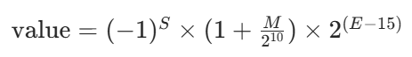
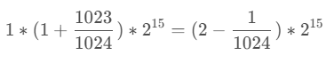

# FP16 与 BF16

同样是 16 位，但 FP16 和 BF16 是两条完全不同的取舍路线：**FP16 精度优先，BF16 范围优先**。

## FP16

**位分配**：1 位符号 + 5 位指数 + 10 位尾数

```
位索引:  15  14-10   9-0
部分:    S   EEEEE   MMMMMMMMMM
        符号 指数(5位) 尾数(10位)

数值范围：约 ±6.10e-5 到 ±65504
```

### 数值范围怎么算

- **符号位（S）**：0 表示正数，1 表示负数
- **指数位（E）**：5 位二进制表示"偏移指数"，偏移量固定为 15（5 位能表示 0~31，减 15 后指数范围是 -15~+16）
- **尾数位（M）**：10 位二进制，表示小数部分，默认前面有一个隐藏的"1"（比如尾数位是 `001`，实际表示 `1.001`）

完整数值公式：



**最大值**（正规数）：
- S = 0
- E = 5 位最大有效二进制 `11110`（十进制 30，注意 `11111` 是保留位，用于表示无穷/NaN）
- M = 10 位最大 `1111111111` = $2^{10}-1$ = 1023



**最小值**（最小正规数）：
- S = 1
- E = 最小有效值 `00001`（十进制 1，`00000` 是保留位，用于非正规数）
- M = 0


### FP16 的痛点

FP16 的数值范围只到 ±65504，训练大模型时：
- **梯度容易下溢**（小于 6.1e-5 直接变 0）
- **激活值容易上溢**（超过 65504 变 inf）

所以 FP16 训练必须配合 **loss scaling** 来把梯度放大回 FP16 可表示范围。这个操作本身就是训练不稳定的一大来源。

## BF16（Brain Floating Point）

**位分配**：1 位符号 + 8 位指数 + 7 位尾数

```
位索引:  15  14-7    6-0
部分:    S   EEEEEEEE  MMMMMMM
        符号 指数(8位) 尾数(7位)

数值范围：和 FP32 几乎一样（~±3.4e38）
精度：远低于 FP16
```

关键点：**BF16 的指数位和 FP32 一样都是 8 位**，所以数值范围和 FP32 完全对齐；牺牲的是尾数位（10 → 7），也就是**表达精度**变差了。

### 为什么大模型都在用 BF16

1. **数值范围和 FP32 几乎一样**，梯度不会轻易炸/下溢，**不用做 loss scaling**
2. **显存直接减半**（对比 FP32）
3. **训练稳定性远高于 FP16**——这是训练大模型时最关键的一条

Google TPU 从一开始就是 BF16 first，NVIDIA 从 A100 开始也全面支持 BF16。现在几乎所有主流大模型的训练都是 BF16。

## FP16 vs BF16 对比

| 维度 | FP16 | BF16 |
|------|------|------|
| **符号位** | 1 | 1 |
| **指数位** | 5 | 8 |
| **尾数位** | 10 | 7 |
| **最大值** | ~65504 | ~3.4e38 |
| **最小正规数** | ~6.1e-5 | ~1.18e-38 |
| **精度** | 高 | 低 |
| **动态范围** | 小 | 与 FP32 一致 |
| **需要 loss scaling** | ✅ | ❌ |
| **典型场景** | 推理、小模型训练 | 大模型训练 |

## 选型建议

- **训练大模型** → BF16（除非硬件不支持）
- **推理（追求精度）** → FP16 或 BF16 都可以
- **推理（追求速度）** → FP8/INT8/FP4 上，FP16/BF16 只作为反量化后的计算精度

---

## 相关文档

- [FP8 详解](./fp8) — 更低比特的浮点格式
- [量化本质](/docs/quantization/basics/quantization-mapping) — 浮点也是一种非线性量化
