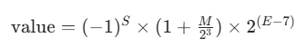

# FP8（E4M3 / E5M2）

FP8 是 H100 时代的重要产物，一次腰斩后从 FP16 走到 8 bit。为了兼顾"要精度"和"要范围"两种需求，FP8 分成两种格式：**E4M3** 和 **E5M2**。

## 两种 FP8 格式

### E4M3 格式

```
位索引:  7  6-3   2-0
部分:    S  EEEE  MMM
        符号 指数(4位) 尾数(3位)

数值范围：约 ±448
```

- **精度更高**（尾数 3 位）
- **范围更小**（指数 4 位）
- **典型用途**：权重、正向激活


### E5M2 格式

```
位索引:  7  6-2   1-0
部分:    S  EEEEE  MM
        符号 指数(5位) 尾数(2位)

数值范围：约 ±57344
```

- **精度较低**（尾数 2 位）
- **范围更大**（指数 5 位）
- **典型用途**：梯度、反向传播



### 为什么要两种？

大模型训练里，权重和梯度的数值分布特性完全不同：
- **权重**：数值范围小（一般在 ±10 以内），但对精度敏感 → 用 **E4M3**
- **梯度**：数值范围极大（可以横跨好几个数量级），对精度反而没那么敏感 → 用 **E5M2**

NVIDIA 的 Transformer Engine 就是按这个思路自动路由的：**前向 activation 和 weight 用 E4M3，反向 gradient 用 E5M2**。

## FP8 为什么比 INT8 更适合大模型量化？

这个问题问得深。答案有两点：

### 1. FP8 的指数位提供了更大的动态范围

大模型激活值经常有**离群点（outliers）**——大部分值在 ±1 附近，但少量值能到 ±100 甚至更大。

- INT8 均匀量化：为了覆盖离群点，scale 必须放大 → 大部分正常值被压到 int8 的中间几格，精度损失严重
- FP8 非线性量化：指数位天然覆盖大范围，尾数位在小值区域仍然保留精度

### 2. INT8 的均匀量化对权重有效，但激活值的不均匀分布是其结构性短板

权重经过训练后一般分布还算集中，INT8 per-channel 就够用。但激活值的长尾分布是 transformer 结构的天然产物（softmax、residual、layernorm 累积），INT8 的均匀步长无法优雅处理。

FP8 的**中间密、两边稀**的步长分布，正好匹配激活值的实际分布。

## FP8 训练/推理的实际用法

| 场景 | 权重 | 激活 | 梯度 |
|------|------|------|------|
| **FP8 训练** | E4M3 | E4M3 | E5M2 |
| **FP8 推理** | E4M3 | E4M3 | — |

推理时其实只用 E4M3 就够了，因为不需要反向传播。

## FP8 vs BF16 训练开销对比

| 维度 | BF16 | FP8 |
|------|------|-----|
| **显存** | 100% | ~50% |
| **算力（H100）** | 参考基准 | ~2× |
| **数值稳定性** | 好 | 需要 per-tensor scale 管理 |
| **代码改动** | 无 | 需要 Transformer Engine 等库 |

FP8 训练能带来接近 2 倍的吞吐，但落地成本比 BF16 高很多——**scale 管理、混合精度策略、跳过某些数值敏感层**都需要专门调。

---

## 相关文档

- [FP16 与 BF16](./fp16-bf16) — 上一档精度
- [NVFP4/MXFP4](./nvfp4-mxfp4) — 更低比特的浮点，用 FP8 作块 scale
- [INT8](./int8) — 同位宽的整数格式对比
