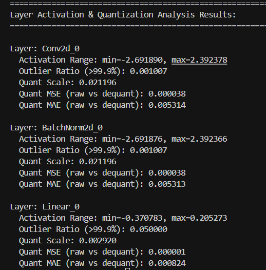

# 量化掉点排查方法论

> 量化上线，掉点是常态。这篇整理小模型时代的经典排查思路，加上大模型量化误差的现代分析方法。

## 一、小模型时代的排查思路（五步法）

在小模型 QAT/PTQ 场景验证过多次。核心就是：**从校准 → 位宽 → 建模 → 训练 → 定位 → 数据**逐层排查。

### 1. 确认校准结果是否合理

- 打开 **verbose** 日志，观察参数和激活的分布直方图，优先关注**动态范围大**的 layer
- 结合业务先验知识，特别关注模型的**输入和输出、自定义算子**等关键节点
- 尝试不同的校准算法（`minmax` / `kl` / `percentile` / `mse` / `potmode`，默认为 `percentile`）
- 若还是部分层校准结果明显不准，可以通过 **`custom_scales`** 手动指定
- 验证初始 loss 是否有改善

### 2. 分析 8-bit 理论精度是否足够

- 一般是模型的**输入和输出**，以及一些**特殊算子**如 Sin/Cos/GridSample，还有带 **index** 性质的激活值
- 与部署负责人确认是否支持 INT16/FP16，若可以，则可以指定为 **`int16_keys`** 或 **`fp32_operations`**

### 3. 分析建模方式是否合理

- 是否将浮点数值范围差异较大的物理量放在一个 Tensor 中，一般涉及模型的**输入和输出、Concat 算子**等
- 若有则改之，和算法/部署负责人沟通模型变动项

### 4. QAT 的 setting 是否合理

- **lr**：一般为浮点训练收敛后同量级的 lr，或者高一个数量级带衰减
- **weight_decay**：0（量化本身就是正则化手段）
- **epochs/iters**：一般为浮点从头训练时长的 1/10，或者和浮点 finetune 时长持平

### 5. 分段排查，缩小范围

- 借助 DAQ 的图搜索功能，在 `graph-preprocess` 中将目标子图的 op 放到 `fp32_operations` 里面（比较费时）

### 6. 针对性措施（确实没有其他明显的问题）

- 调整数据分布，针对问题场景增加数据
- 单任务 finetune

## 二、大模型量化效果差怎么办

### 直观感知量化误差的 4 个硬核方法

#### 1. 每层输出对比法：看"误差传播"

同时跑 **FP16 原版**和**量化模型**，把每一层 transformer 的 **hidden state** 拿出来算 **余弦相似度 / MSE**，画成 **层 vs 误差** 曲线，找到误差层的源头。

#### 2. 权重/激活直方图可视化

把每层 weight、act 画直方图：
- 看到**大量 outliers、长尾分布** → 一眼就能判断
- 或者数值范围跨好几个数量级 → 量化必崩

规律：
- **outlier 多** → 量化必崩
- **激活爆炸** → 一量化就失真

#### 3. 敏感性分层 ablation

逐层做**混合精度消融实验**：只把某一层保持 FP16，其他层全部是正常的量化精度。如果哪层一开高精度效果就好了，那就是最敏感、误差最大的层。

#### 4. 工业界大模型常用方案：Hook 采集

在模型前向里**插轻量 hook**，收集每层的激活范围、异常值比例、量化前后差异。这是一份可以直接跑的 hook 代码：

```python
import torch
import torch.nn as nn
import numpy as np
from collections import defaultdict


class QuantAnalysisHook:
    """轻量级 Hook：收集量化相关的激活统计信息"""

    def __init__(self, quant_bit=8, outlier_percentile=99.9):
        """
        Args:
            quant_bit: 量化位宽（默认 INT8）
            outlier_percentile: 异常值分位数（超过该分位数判定为异常值）
        """
        self.quant_bit = quant_bit
        self.outlier_percentile = outlier_percentile
        self.layer_stats = defaultdict(dict)
        self.layer_idx = defaultdict(int)

    def _quantize_dequantize(self, x):
        """简易 INT8 对称量化 + 反量化，模拟真实量化过程"""
        x_abs_max = torch.max(torch.abs(x)).item()
        if x_abs_max == 0:
            scale = 1.0
        else:
            scale = x_abs_max / (2 ** (self.quant_bit - 1) - 1)

        x_q = torch.clamp(
            torch.round(x / scale),
            -(2 ** (self.quant_bit - 1)),
            2 ** (self.quant_bit - 1) - 1,
        )
        x_dq = x_q * scale
        return x_dq, scale

    def hook_fn(self, module, input, output):
        """前向 hook：收集激活统计"""
        if not isinstance(output, torch.Tensor):
            return
        if output.numel() == 0:
            return

        layer_type = module.__class__.__name__
        layer_name = f"{layer_type}_{self.layer_idx[layer_type]}"
        self.layer_idx[layer_type] += 1

        # 1. 激活范围
        act_min = torch.min(output).item()
        act_max = torch.max(output).item()
        self.layer_stats[layer_name]["act_min"] = act_min
        self.layer_stats[layer_name]["act_max"] = act_max

        # 2. 异常值比例
        output_np = np.array(output.detach().cpu().numpy()).flatten()
        if len(output_np) <= 1:
            outlier_ratio = 0.0
        else:
            outlier_threshold = np.percentile(output_np, self.outlier_percentile)
            outlier_count = np.count_nonzero(output_np > outlier_threshold)
            outlier_ratio = outlier_count / len(output_np)
        self.layer_stats[layer_name]["outlier_ratio"] = round(outlier_ratio, 6)

        # 3. 量化前后差异（MSE/MAE）
        output_dq, scale = self._quantize_dequantize(output)
        mse = torch.mean((output - output_dq) ** 2).item()
        mae = torch.mean(torch.abs(output - output_dq)).item()
        self.layer_stats[layer_name]["quant_scale"] = round(scale, 6)
        self.layer_stats[layer_name]["quant_mse"] = round(mse, 6)
        self.layer_stats[layer_name]["quant_mae"] = round(mae, 6)

    def register_hooks(self, model):
        """为模型所有核心层注册 Hook"""
        hooks = []
        for module in model.modules():
            if isinstance(module, (nn.Conv2d, nn.Linear, nn.BatchNorm2d)):
                hook = module.register_forward_hook(self.hook_fn)
                hooks.append(hook)
        return hooks

    def print_stats(self):
        print("=" * 80)
        print("Layer Activation & Quantization Analysis Results:")
        print("=" * 80)
        for layer_name, stats in self.layer_stats.items():
            print(f"\nLayer: {layer_name}")
            print(f"  Activation Range: min={stats['act_min']:.6f}, max={stats['act_max']:.6f}")
            print(f"  Outlier Ratio (>{self.outlier_percentile}%): {stats['outlier_ratio']:.6f}")
            print(f"  Quant Scale: {stats['quant_scale']:.6f}")
            print(f"  Quant MSE (raw vs dequant): {stats['quant_mse']:.6f}")
            print(f"  Quant MAE (raw vs dequant): {stats['quant_mae']:.6f}")


# -------------------------- 使用示例 --------------------------
if __name__ == "__main__":
    class TestModel(nn.Module):
        def __init__(self):
            super().__init__()
            self.conv1 = nn.Conv2d(3, 16, 3, 1, 1)
            self.bn1 = nn.BatchNorm2d(16)
            self.relu = nn.ReLU()
            self.fc1 = nn.Linear(16 * 32 * 32, 10)

        def forward(self, x):
            x = self.relu(self.bn1(self.conv1(x)))
            x = x.flatten(1)
            x = self.fc1(x)
            return x

    model = TestModel().eval()
    hook = QuantAnalysisHook(quant_bit=8, outlier_percentile=99.9)
    hooks = hook.register_hooks(model)

    test_input = torch.randn(2, 3, 32, 32)
    with torch.no_grad():
        model(test_input)

    hook.print_stats()

    for h in hooks:
        h.remove()
```

**典型输出**：



### 找到量化敏感层怎么做？

1. **混合精度**：敏感层不量化或使用更高精度
2. 对于**异常值多的层**，合理设置 clip 值，把异常值掐掉
3. 还是掉点可以上**量化后微调**（QAT / 量化蒸馏）

## 三、量化效果差的常见原因清单

### 1. 量化方案本身的局限性

- **量化位宽不足**：如采用 INT4 量化时，数值表示范围窄、精度损失大，尤其对数值波动大的层（如全连接层）影响显著
- **量化方式不合理**：
  - 对非对称分布的特征（如激活值偏态分布）用对称量化 → 部分特征被截断
  - 未针对异常层采用**混合精度**（如关键层用 FP16，普通层用 INT8）
- **量化校准不充分**：
  - 校准数据集规模太小、代表性不足
  - 校准方法不当（如仅用前 100 个样本校准）
  - 导致 scale/zero_point 计算不准确，无法真实反映原始数据分布

### 2. 模型结构与参数特性

- **敏感层特性**：某些结构对量化天然敏感（LayerNorm、Softmax、Attention 输出、residual add 位置）
- **参数数值异常**：部分层的参数数值极小（接近 0）或极大，激活值存在极端 outliers

### 3. 数据相关问题

- **校准数据与训练/测试数据分布不一致**：校准数据未覆盖测试数据的所有场景，导致量化参数适配性差
- **数据预处理差异**：量化时的数据预处理（如归一化、标准化）与训练时不一致，导致特征分布偏移

## 四、排查流程速查

```
掉点了？

├─ 第一步：定位是哪几层的锅
│   ├─ 逐层 hidden state 对比（FP vs Quant）
│   ├─ 敏感性 ablation（逐层保 FP16 看效果）
│   └─ Hook 采集：outlier 比例 + MSE
│
├─ 第二步：判断原因
│   ├─ outlier 多 → 换 Percentile / 上 SmoothQuant
│   ├─ 分布长尾 → 换 KL / 换 FP8
│   ├─ 敏感层无解 → 上混合精度（关键层 FP16）
│   └─ 校准数据不足 → 扩数据集
│
├─ 第三步：还是不行
│   ├─ PTQ 换更高级算法（AWQ / GPTQ / HQQ）
│   ├─ 上 QAT / 量化蒸馏
│   └─ 位宽升级（INT4 → INT8 / FP8）
│
└─ 第四步：写复盘，避免下次踩同样的坑
```

---

## 相关文档

- [PTQ 校准算法](./calibration-algorithms) — 换校准算法就是第一步
- [激活量化](/docs/quantization/basics/activation-quantization) — 激活侧的坑
- [QAT 方法](/docs/quantization/qat) — PTQ 救不了的时候上 QAT
- [QAD vs OPD](/docs/quantization/practice-notes/qad-vs-opd) — 量化蒸馏的思路
