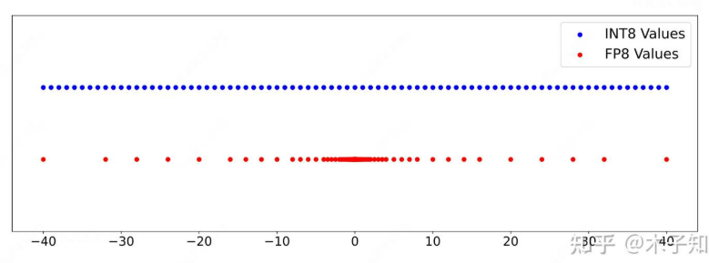
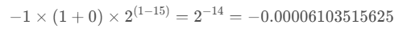
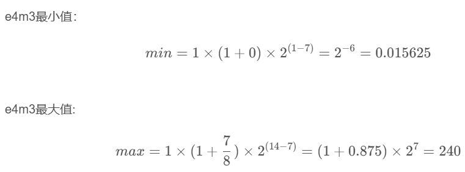
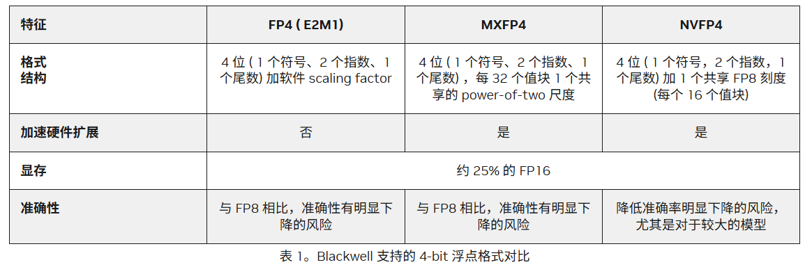
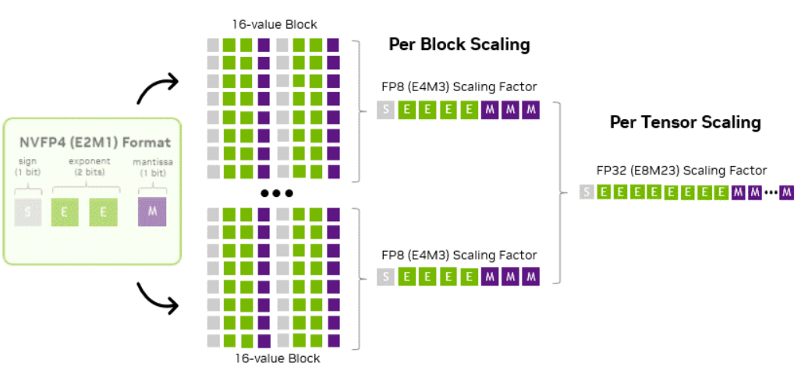
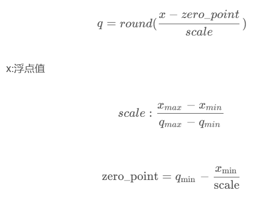
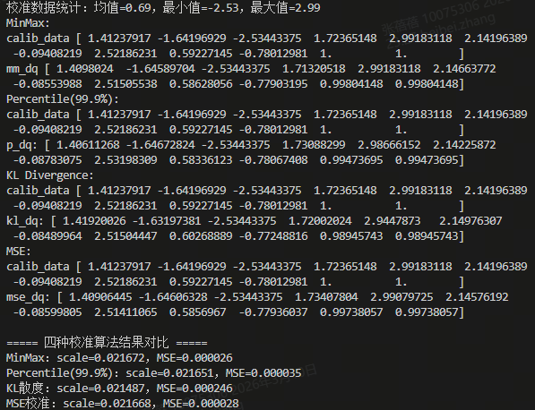
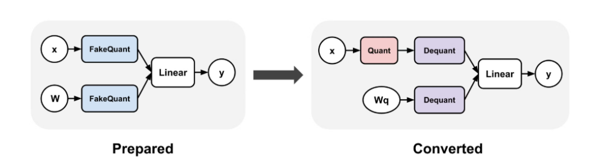

# 量化基础

量化模型的核心是：把高精度权重（如 FP32）映射到低精度（如 INT8/INT4）

# 常见量化格式

## FP精度

Floating Point，是最原始的，IEEE定义的标准浮点数类型。由符号位（sign）、指数位（exponent）和小数位（fraction）三部分组成。

FP的量化步长是中间密两边稀疏



### FP16

```Plain Text
位索引:  15  14-10   9-0
部分:    S   EEEEE   MMMMMMMMMM
        符号 指数(5位) 尾数(10位)
数值范围：约 ±6.10 × 10^-5 到 ±65504
```

数值范围怎么计算？

- **符号位（S）**：0 表示正数，1 表示负数（决定数值正负）；

- **指数位（E）**：用 5 位二进制表示「偏移指数」，偏移量固定为 15（因为 5 位能表示 0\~31，减 15 后指数范围是 \- 15\~16）；

- **尾数位（M）**：10 位二进制，表示小数部分，默认前面有一个隐藏的「1」（比如尾数位是`001`，实际表示`1.001`）。

则完整的数值公式是：


最大值：

- S=0

- E=5 位最大二进制是`11110`（十进制 30，注意：`11111`是保留位，用于表示无穷 / NaN，不能用）

- M=10位的最大二进制是1111111111=2^\{10\}\-1=1023

则max=


最小值：

- S=1

- E=最小有效值是`00001`（十进制 1，`00000`是保留位，用于表示非正规数）

- M=0

则min=



### FP8

```Plain Text
E5M2格式
位索引:  7  6-2   1-0
部分:    S  EEEEE  MM
        符号 指数(5位) 尾数(2位)
E4M3格式
位索引:  7  6-3   2-0
部分:    S  EEEE   MMM
        符号 指数(4位) 尾数(3位)
```




FP8比INT8更适合大模型的量化：

1. FP8的指数位提供更大的动态范围，天然适配激活值的离群点

2. INT8的均匀量化对权重有效，但激活值的不均匀分布式其结构性短板

### NVFP4

https://developer\.nvidia\.cn/blog/introducing\-nvfp4\-for\-efficient\-and\-accurate\-low\-precision\-inference/

4bit格式分类：



1. FP4

格式中的值大约介于 \-6 到 6 之间。范围内的值可以包括 0\.0、0\.5、1\.0、1\.5、2、3、4、6 \(负范围相同\)

缺点：原生范围太小

1. NVFP4创新点

    1. 高精度缩放因子编码 High\-precision scale encoding

    2. 两级微块缩放策略 A two\-level micro\-block scaling strategy



对per tensor应用fp32的缩放系数：**把张量的全局scale缩放到适合块缩放的尺度**\(fp8之内\)

对每16的值的块应用细粒度的e4m3缩放系数：**把每个微块缩放到适合**\(fp4表示的尺度\)

#### **举例子：**

NVFP4把16个权重值当作一个NVFP4微块来演示：

微块1\(小微块\)

16 个 FP32 权重（真实值）：

**\[0\.23, \-0\.18, 0\.41, \-0\.33,**

**0\.59, \-0\.62, 0\.37, \-0\.29,**

**0\.71, \-0\.85, 0\.15, \-0\.09, **

**0\.53, \-0\.47, 0\.26, \-0\.31\]**

这些值都在 \- 0\.85\~0\.71 之间，需要量化为 NVFP4。

**步骤1：**计算两级缩放因子（解决 E2M1 范围窄的问题）

NVFP4 的核心是「16 元素微块 \+ 双层缩放」，先算缩放值：

- **全局缩放（global\_scale）**：本例中权重范围小，全局缩放取 1\.0（FP32 格式）。

- **块缩放（block\_scale）**：针对这 16 个值，NVIDIA 会计算一个 FP8 E4M3 格式的缩放因子，目的是把所有值缩到 E2M1 的可表示范围（\-6\~\+6）内。本例中，计算得`block_scale = 0.125`（FP8 E4M3 格式存储，精确到 0\.125）；

**步骤 2：**将原始值缩放到 E2M1 范围

每个原始值 ÷ \(block\_scale × global\_scale\) = 缩放到 E2M1 可表示的范围：比如：

- 0\.23 ÷ 0\.125 = 1\.84（落在 E2M1 的 1\.5\~2 之间）；

- \-0\.18 ÷ 0\.125 = \-1\.44（落在 E2M1 的 \- 1\.5\~\-1 之间）；

- 0\.41 ÷ 0\.125 = 3\.28（落在 E2M1 的 3\~4 之间）；

- 0\.59 ÷ 0\.125 = 4\.72（落在 E2M1 的 4\~6 之间）；

- 0\.71 ÷ 0\.125 = 5\.68（接近 E2M1 的 6）；

**步骤 3：**量化为 4bit E2M1（取最近值）

把缩放后的值映射到 E2M1 的固定值列表中

**步骤 4：**推理时反量化（还原值）

用「E2M1 值 × 块缩放 × 全局缩放」还原：

- 0\.23 的量化还原：2 × 0\.125 × 1\.0 = 0\.25（接近原 0\.23）；

- \-0\.18 的量化还原：\-1\.5 × 0\.125 × 1\.0 = \-0\.1875（接近原 \- 0\.18）；

NVFP4特点：

- 虽然步骤4中每个值有小误差，但是16个值的整体分布和大小趋势保留，模型推理精度几乎不受影响，而存储成本仅为 FP32 的 1/8（4bit vs 32bit）

- 4bit之外多余的存储开销

- 假设100万权重，全局缩放的4字节可忽略：则额外开销为1/8=12\.5%

    - NVFP4核心数据：16个元素一个微块，每个元素4bit; 16\*4=64bit=8字节

    - 块缩放因子：每个微块1个FP8\(8bit=1字节\)

    - 全局缩放因子：整个张量配一个fp32\(32bit=4字节\)，张量越大，全局缩放的分摊越低

    - 假设100万权重，全局缩放的4字节可忽略：则额外开销为1/8=12\.5%

### MXFP4

在理解上面的NVFP4之后，MXFP4的机制就相对比较简单了。MXFP4是由OCP社区定义在2024年提出的一种FP4格式，侧重通用性，既支持训练也支持推理。而NVFP4则是NVIDIA针对Blackwell优化的专用推理格式。

从与NVFP4对比的角度来理解MXFP4:

### BF16

由于其能够保持与FP32相同的数值范围，BF16在深度学习中越来越受欢迎，特别是在Google的TPU等硬件加速器中得到了支持。BF16可以提供比FP16更好的训练稳定性，同时仍然享有FP16的计算和存储效率。

**为什么用 bf16？**

- **数值范围和 fp32 几乎一样**，梯度不会轻易炸 / 下溢

- **显存直接减半**

- **训练稳定性远高于 fp16**

## INT精度

### INT8

https://blog\.csdn\.net/Nichlson/article/details/121085747

PTQ原理：



反量化    $x=scale*(q-zero\_point)$


# 模型量化的分类

## 线性量化与非线性量化

## 量化粒度：逐层、逐通道、逐组

### Per tensor量化：

Per\-Tensor Quantization（单张量量化）是最基础的一种量化方式。简单来说，它就是对整个 Tensor（张量）里的所有数值，统一使用同一组缩放因子（Scale）和零点（Zero\-point）进行转换。

1. 整个张量（如一层权重 / 激活）共享**同一组** `scale` 和 `zero_point`。

2. 对数值分布差异大的张量（如大模型权重）精度损失大。

3. 经典方法：

    1. **MinMax 量化**：取张量全局 min/max 计算 `scale`，最简单的PTQ方案

### Per channel量化：

1. 经典方法：

    1. **SmoothQuant**：对权重做平滑预处理，降低激活量化误差，适配 Per Channel 量化。

### Per Group量化：

1. **经典方法：**

    1. **GPTQ**：按列分组量化，迭代优化权重补偿误差

    2. **AWQ**：按重要性分组，保护权重中关键值，低比特下精度优于 GPTQ。

    3. **NVFP4/MXFP4**：硬件友好的分组浮点量化，NVIDIA/AMD 大模型推理标配。

使用普通的minmax ptq和AWQ及GPTQ,SMoothquant保存的模型有什么区别：

## 权重量化与权重激活量化

## 量化误差来源：

## 激活量化：动态和静态

激活量化的使用主要分为准备阶段（校准）和推理阶段（实际计算）。与权重量化不同，激活值是动态变化的，因此其核心难点在于如何确定量化参数。

### 静态激活量化

**适用场景：**适用于对延迟要求极高的部署场景。需要提前跑少量数据来“预估”激活值的范围。

- **步骤1：**模型准备 将训练好的FP32模型插入量化观察节点，此时模型不进行实际量化，只统计数值范围。

- **步骤2：**校准 选取500\-1000条典型输入数据喂给模型。模型推理过程中，观察节点记录每一层激活值的最大值和最小值，并计算得出固定的缩放因子（Scale）和零点。

- **步骤3：**量化导出 校准完成后，**将Scale和Z写入模型配置**。推理时直接使用这些固定参数进行量化计算。

- 优缺点：推理**完全无额外计算，速度最快，对分布变化大的输入（如文本、图像差异大）精度掉得明显**

### 动态激活量化

**适用场景：**适用于对精度要求较高或输入分布极不稳定的场景。

- 流程：不需要校准步骤。在推理时，每当数据流过一层，实时计算该Batch数据的最大/最小值，动态生成Scale和Z。

- 优缺点：精度高，但因为要实时统计数值，会增加额外的计算开销。

## 量化误差来源：

# 主流PTQ校准算法

校准算法：PTQ 的核心，本质是**用校准数据统计张量分布，找到最优的量化缩放因子**，平衡精度和加速效果。

## MinMax

方法介绍：MinMax 是**最简单、最直接的量化校准算法**，核心就是 “用数据的全局最小值和最大值，定出量化的‘边界’”。

```Plain Text
# 缩放系数：决定浮点数和整数的映射比例
scale = (max_val - min_val) / (2^8 - 1) = (max_val - min_val) / 255
# 零点：把浮点数最小值映射到整数0的偏移量
zero_point = -min_val / scale
# 量化（浮点数→整数）
q_data = round(data / scale + zero_point)
# 反量化（整数→浮点数）   
dq_data = (q_data - zero_point) * scale
```

## 百分位（Percentile）/ 分位数裁剪

核心逻辑：

MinMax 会被**异常值 / 离群点**带偏（比如激活值里的极端大值），Percentile 只取分布中某一百分位的数值作为量化上限（比如 99\.9%、99\.99%），忽略极端值。

- 例：统计激活值的 99\.9% 分位数作为 max，min 仍取最小值，再计算 scale = \(max \- min\) / \(2^bit \- 1\)。

```Python
def percentile_calibration(data, percentile=99.9):
"""Percentile校准：用指定分位数替代max，避免离群点"""     
    min_val = np.min(data)# 计算百分位的max（忽略极端值）     
    max_val = np.percentile(data, percentile)     
    scale = (max_val - min_val) / 255.0     
    zero_point = -min_val / scale     
return scale, zero_point, min_val, max_val
```


## KL 散度校准（KL\-Divergence）

核心逻辑

衡量**量化后分布**与**原始浮点分布**的 KL 散度（差异），找到使 KL 散度最小的 scale，本质是 “最小化量化带来的信息损失”。

步骤：

1. 用校准数据统计浮点激活值的直方图；

2. 遍历不同的 scale 候选值，计算量化后直方图与原始直方图的 KL 散度；

3. 选择 KL 散度最小的 scale 作为最优值。

## MSE 校准

核心逻辑：

最小化**量化反量化后的数据**与**原始浮点数据**的均方误差（MSE），找到最优 scale。

最小化该值的 scale 即为最优。

## 校准算法的简单实现

```Python
import numpy as np
import matplotlib.pyplot as plt

# ===================== 1. 生成模拟校准数据（带离群点的激活值） =====================def generate_calibration_data():
    """生成模拟的激活值数据：正态分布 + 少量离群点（贴近真实模型的激活分布）"""# 主体：正态分布（均值0，标准差2），10000个数据
    main_data = np.random.normal(loc=0, scale=2, size=20)
    # 离群点：随机加10个大值（模拟极端值）
    outliers = np.random.uniform(low=1, high=1, size=2)
    # 合并数据
    calibration_data = np.concatenate([main_data, outliers])
    return calibration_data

# 生成校准数据并可视化（直观看分布）
calib_data = generate_calibration_data()
plt.hist(calib_data, bins=100, alpha=0.7, label='Activation Distribution')
plt.title('模拟激活值分布（含离群点）')
plt.xlabel('激活值')
plt.ylabel('频次')
plt.legend()
plt.show()

# ===================== 2. 通用量化/反量化函数（所有算法共用） =====================def quantize_dequantize(data, scale, zero_point=0, bit=8):
    """
    量化 + 反量化（验证校准算法的精度）
    :param data: 原始浮点数据
    :param scale: 校准算法算出的缩放系数
    :param zero_point: 零点（非对称量化用，对称量化=0）
    :param bit: 量化比特数（INT8=8）
    :return: 反量化后的数据（模拟量化后的精度损失）
    """# INT8的数值范围：0~255（非对称）
    q_min = 0
    q_max = 2**bit - 1# 量化：浮点数 → 整数
    q_data = np.round((data / scale) + zero_point)
    # 裁剪到量化范围（避免溢出）
    q_data = np.clip(q_data, q_min, q_max)
    # 反量化：整数 → 浮点数（模拟推理时的还原）
    dq_data = (q_data - zero_point) * scale
    return dq_data

# ===================== 3. 四种校准算法实现 =====================def minmax_calibration(data):
    """MinMax校准：用全局最小/最大值算scale"""
    min_val = np.min(data)
    max_val = np.max(data)
    # 避免max=min导致除0if max_val == min_val:
        max_val = min_val + 1e-6# INT8非对称量化：scale = (max - min) / 255
    scale = (max_val - min_val) / 255.0# 非对称量化的zero_point
    zero_point = -min_val / scale
    # 裁剪zero_point到0~255范围
    zero_point = np.clip(zero_point, 0, 255)
    return scale, zero_point, min_val, max_val

def percentile_calibration(data, percentile=99.9):
    """Percentile校准：用指定分位数替代max，避免离群点"""
    min_val = np.min(data)
    # 计算百分位的max（忽略极端值）
    max_val = np.percentile(data, percentile)
    # 避免max=min导致除0if max_val == min_val:
        max_val = min_val + 1e-6
    scale = (max_val - min_val) / 255.0
    zero_point = -min_val / scale
    zero_point = np.clip(zero_point, 0, 255)
    return scale, zero_point, min_val, max_val

def kl_divergence_calibration(data, num_bins=2048, bit=8):
    """KL散度校准：找使量化后分布与原分布差异最小的scale"""
    q_max = 2**bit - 1  # 255 for INT8
    min_val = np.min(data)
    max_val = np.max(data)
    
    # 1. 预处理：避免min=maxif max_val == min_val:
        max_val = min_val + 1e-6# 2. 统计原始数据的直方图（分布P）# 生成等宽bins
    bins = np.linspace(min_val, max_val, num_bins + 1)
    hist, _ = np.histogram(data, bins=bins)
    # 归一化得到原始分布概率P（避免除0）
    hist_sum = np.sum(hist)
    if hist_sum == 0:
        return minmax_calibration(data)
    P = hist / hist_sum
    epsilon = 1e-10# 3. 生成候选max值（从99%到99.99%分位数，避免遍历极端值）
    candidate_max_list = np.percentile(data, np.arange(99.0, 99.99, 0.01))
    candidate_max_list = [c for c in candidate_max_list if c > min_val]
    # 如果候选列表为空，用MinMax结果if not candidate_max_list:
        return minmax_calibration(data)
    
    best_kl = float('inf')
    best_scale = None
    best_zero_point = None
    best_candidate_max = None# 4. 遍历每个候选max值，计算KL散度for candidate_max in candidate_max_list:
        # 计算当前候选的scale和zero_point
        scale = (candidate_max - min_val) / q_max
        zero_point = -min_val / scale
        zero_point = np.clip(zero_point, 0, q_max)
        
        # 5. 将原始数据量化，得到量化后的值
        q_data = np.round((data / scale) + zero_point)
        q_data = np.clip(q_data, 0, q_max)
        
        # 6. 统计量化后的数据分布Q（维度和P一致的关键步骤）# 把量化后的值映射回原始bins区间，统计每个原始bin的量化后频次
        q_hist = np.zeros_like(hist)
        for i in range(num_bins):
            # 找到原始bin[i]对应的数值
            bin_min = bins[i]
            bin_max = bins[i+1]
            # 找到落在该bin的原始数据
            mask = (data >= bin_min) & (data < bin_max)
            if np.sum(mask) == 0:
                continue# 这些数据量化后的值
            q_vals = q_data[mask]
            # 统计这些量化值的频次，并合并到q_hist[i]
            q_hist[i] = np.sum(q_vals)
        
        # 7. 归一化得到分布Q
        q_hist_sum = np.sum(q_hist)
        if q_hist_sum == 0:
            Q = np.zeros_like(P)
        else:
            Q = q_hist / q_hist_sum
        
        # 8. 计算KL散度 D(P||Q)# 避免log(0)和除0
        P_safe = P + epsilon
        Q_safe = Q + epsilon
        kl = np.sum(P * np.log(P_safe / Q_safe))
        
        # 9. 更新最优参数if kl < best_kl:
            best_kl = kl
            best_scale = scale
            best_zero_point = zero_point
            best_candidate_max = candidate_max
    
    # 兜底：如果没找到最优值，用MinMaxif best_scale is None:
        best_scale, best_zero_point, _, best_candidate_max = minmax_calibration(data)
    
    return best_scale, best_zero_point, min_val, best_candidate_max

def mse_calibration(data, bit=8):
    """MSE校准：找使量化反量化后MSE最小的scale"""
    q_max = 2**bit - 1
    min_val = np.min(data)
    max_val = np.max(data)
    
    # 生成候选max值（99%~99.99%分位数）
    candidate_max_list = np.percentile(data, np.arange(99.0, 99.99, 0.01))
    candidate_max_list = [c for c in candidate_max_list if c > min_val]
    if not candidate_max_list:
        return minmax_calibration(data)
    
    best_mse = float('inf')
    best_scale = None
    best_zero_point = None
    best_candidate_max = None# 遍历候选max值for candidate_max in candidate_max_list:
        scale = (candidate_max - min_val) / q_max
        zero_point = -min_val / scale
        zero_point = np.clip(zero_point, 0, q_max)
        
        # 量化反量化
        dq_data = quantize_dequantize(data, scale, zero_point, bit)
        # 计算MSE
        mse = np.mean((data - dq_data) **2)
        
        # 更新最优参数if mse < best_mse:
            best_mse = mse
            best_scale = scale
            best_zero_point = zero_point
            best_candidate_max = candidate_max
    
    # 兜底if best_scale is None:
        best_scale, best_zero_point, _, best_candidate_max = minmax_calibration(data)
    
    return best_scale, best_zero_point, min_val, best_candidate_max

# ===================== 4. 测试样例：运行所有算法并对比 =====================if __name__ == "__main__":
    # 1. 生成校准数据
    calib_data = generate_calibration_data()
    print(f"校准数据统计：均值={np.mean(calib_data):.2f}，最小值={np.min(calib_data):.2f}，最大值={np.max(calib_data):.2f}")
    
    # 2. 运行四种校准算法# MinMax
    mm_scale, mm_zp, mm_min, mm_max = minmax_calibration(calib_data)
    mm_dq = quantize_dequantize(calib_data, mm_scale, mm_zp)
    mm_mse = np.mean((calib_data - mm_dq)** 2)
    print("MinMax:")
    print("calib_data",calib_data)
    print("mm_dq",mm_dq)
    
    # Percentile（99.9%）
    p_scale, p_zp, p_min, p_max = percentile_calibration(calib_data, 99.9)
    p_dq = quantize_dequantize(calib_data, p_scale, p_zp)
    p_mse = np.mean((calib_data - p_dq) **2)
    print("Percentile(99.9%):")
    print("calib_data",calib_data)
    print("p_dq:",p_dq)

    
    # KL散度
    kl_scale, kl_zp, kl_min, kl_max = kl_divergence_calibration(calib_data)
    kl_dq = quantize_dequantize(calib_data, kl_scale, kl_zp)
    kl_mse = np.mean((calib_data - kl_dq)** 2)
    print("KL Divergence:")
    print("calib_data",calib_data)
    print("kl_dq:",kl_dq)
    
    # MSE
    mse_scale, mse_zp, mse_min, mse_max = mse_calibration(calib_data)
    mse_dq = quantize_dequantize(calib_data, mse_scale, mse_zp)
    mse_final = np.mean((calib_data - mse_dq) **2)
    print("MSE:")
    print("calib_data",calib_data)
    print("mse_dq:",mse_dq)
    
    # 3. 输出结果对比print("\n===== 四种校准算法结果对比 =====")
    print(f"MinMax：scale={mm_scale:.6f}，MSE={mm_mse:.6f}")
    print(f"Percentile(99.9%)：scale={p_scale:.6f}，MSE={p_mse:.6f}")
    print(f"KL散度：scale={kl_scale:.6f}，MSE={kl_mse:.6f}")
    print(f"MSE校准：scale={mse_scale:.6f}，MSE={mse_final:.6f}")
```



# 梳理量化导致的掉点问题该怎么解决

## ZYT小模型思路汇总

ZYT量化问题常用分析思路：

1. **确认校准结果是否合理**

    1. 打开***verbose***，观察参数和激活的分布直方图，优先关注动态范围大的layer

    2. 结合业务先验知识，特别关注模型的**输入和输出、自定义算子**等关键节点

    3. 尝试不同的校准算法（minmax, kl, percentile, mse, potmode，默认为percentile）

    4. 若还是部分层校准结果明显不准，可以通过***custom\_scales***进行指定

    5. 验证初始loss是否有改善

2. **分析8\-bit理论精度是否足够**

    1. 一般是模型的**输入和输出**，以及一些**特殊算子**如Sin/Cos/GridSample，还有带**index**性质的激活值

    2. 与部署负责人确认是否支持int16/fp16，若可以，则可以指定为***int16\_keys***或***fp32\_operations***

3. **分析建模方式是否合理**

    1. 是否将浮点数值范围差异较大的物理量放在一个Tensor中，一般涉及模型的**输入和输出、Concat算子**等

    2. 若有则改之，和算法/部署负责人沟通模型变动项

4. **QAT的setting是否合理**

    1. **lr**：一般为浮点训练收敛后同量级的lr，或者高一个数量级带衰减

    2. **weight\_decay**: 0 （量化本身就是正则化手段）

    3. **epochs/iters**：一般为浮点从头训练时长的1/10，或者和浮点finetune时长持平

5. **分段排查，缩小范围**

    1. 借助DAQ的图搜索功能，在graph\-preprocess中将目标子图的op放到fp32\_operations里面（比较费时）

6. **针对性措施（确实没有其他明显的问题）**

    1. 调整数据分布，针对问题场景增加数据

    2. 单任务finetune（MTL模型）

## 大模型量化效果差分析思路

### 感知量化误差

直观感知量化误差的 4 个硬核方法

1. 每层输出对比法：看 “误差传播”：

    同时跑 **FP16 原版** 和 **量化模型，**把每一层 transformer 的 **hidden state 拿出来算余弦相似度 / MSE，**画成**层 vs 误差**曲线，找到误差层的源头

2. 权重 / 激活直方图可视化

    把每层 weight、act 画直方图：

    - 看到**大量 outliers、长尾分布**

    - 或者数值范围跨好几个数量级

    一眼就能判断：

    - **outlier 多 → 量化必崩**

    - **激活爆炸 → 一量化就失真**

3. 敏感性分层 ablation

    1. 逐层做混合精度消融实现，只把某一层保持fp16,其他层全部是正常的量化精度，如果哪层的一开高精度效果好了，那就是最敏感误差最大的层

4. 工业界大模型常用的方案

    1. 在模型前向里**插轻量 hook，收集每层的激活范围，异常值比例，量化后前后差异**

    2. 示例代码：

    ```Python
    *import* torch
    *import* torch.nn *as* nn
    *import* numpy *as* np
    *from* collections *import* defaultdict
    
    *# 轻量级Hook类：收集量化相关的激活统计信息*
    class QuantAnalysisHook:
        def __init__(*self*, *quant_bit*=8, *outlier_percentile*=99.9):
            """
            Args:
                quant_bit: 量化位宽（默认INT8）
                outlier_percentile: 异常值分位数（超过该分位数判定为异常值）
            """
            self.quant_bit = quant_bit
            self.outlier_percentile = outlier_percentile
            *# 存储每层的统计结果：key=层名, value=字典（包含min/max/异常值比例/量化差异等）*
            self.layer_stats = defaultdict(dict)
            *# 记录层的索引（避免同名层覆盖）*
            self.layer_idx = defaultdict(int)
    
        def _quantize_dequantize(*self*, *x*):
            """简易INT8对称量化+反量化，模拟真实量化过程"""
            *# 对称量化：scale = max(abs(min), abs(max)) / (2^(bit-1) - 1)*
            x_abs_max = torch.max(torch.abs(x)).item()
            *if* x_abs_max == 0:
                scale = 1.0
            *else*:
                scale = x_abs_max / (2 ** (self.quant_bit - 1) - 1)
            
            *# 量化：x_q = round(x / scale)，限制在INT8范围*
            x_q = torch.clamp(torch.round(x / scale), 
                              -2 ** (self.quant_bit - 1), 
                              2 ** (self.quant_bit - 1) - 1)
            *# 反量化：恢复到浮点，用于计算与原始值的差异*
            x_dq = x_q * scale
            *return* x_dq, scale
    
        def hook_fn(*self*, *module*, *input*, *output*):
            """Hook函数：前向时执行，收集激活统计信息"""
            *# 仅处理tensor类型的输出（跳过tuple/list等）*
            *if* not isinstance(output, torch.Tensor):
                *return*
            
            *# 跳过空张量或0维张量*
            *if* output.numel() == 0:
                *return*
            
            *# 生成唯一层名（层类型+索引）*
            layer_type = module.__class__.__name__
            layer_name = f"{layer_type}_{self.layer_idx[layer_type]}"
            self.layer_idx[layer_type] += 1
    
            *# 1. 收集激活范围（min/max）*
            act_min = torch.min(output).item()
            act_max = torch.max(output).item()
            self.layer_stats[layer_name]["act_min"] = act_min
            self.layer_stats[layer_name]["act_max"] = act_max
    
            *# 2. 计算异常值比例（修复NumPy兼容性问题）*
            *# 方式1：先转成纯NumPy数组（避免子类封装问题）*
            output_np = np.array(output.detach().cpu().numpy())
            output_flat = output_np.flatten()
            
            *# 防护：避免空数组或单值数组导致分位数计算失败*
            *if* len(output_flat) <= 1:
                outlier_ratio = 0.0
            *else*:
                outlier_threshold = np.percentile(output_flat, self.outlier_percentile)
                *# 改用NumPy原生的布尔索引求和（更稳定）*
                outlier_mask = output_flat > outlier_threshold
                outlier_count = np.count_nonzero(outlier_mask)
                outlier_ratio = outlier_count / len(output_flat)
            
            self.layer_stats[layer_name]["outlier_ratio"] = round(outlier_ratio, 6)
    
            *# 3. 计算量化前后的差异（MSE/MAE）*
            output_dq, scale = self._quantize_dequantize(output)
            mse = torch.mean((output - output_dq) ** 2).item()  *# 均方误差*
            mae = torch.mean(torch.abs(output - output_dq)).item()  *# 平均绝对误差*
            self.layer_stats[layer_name]["quant_scale"] = round(scale, 6)
            self.layer_stats[layer_name]["quant_mse"] = round(mse, 6)
            self.layer_stats[layer_name]["quant_mae"] = round(mae, 6)
    
        def register_hooks(*self*, *model*):
            """为模型所有核心层注册Hook"""
            hooks = []
            *for* module *in* model.modules():
                *# 仅为卷积/全连接/BN层注册（可根据需求扩展）*
                *if* isinstance(module, (nn.Conv2d, nn.Linear, nn.BatchNorm2d)):
                    hook = module.register_forward_hook(self.hook_fn)
                    hooks.append(hook)
            *return* hooks
    
        def print_stats(*self*):
            """打印所有层的统计结果"""
            print("="*80)
            print("Layer Activation & Quantization Analysis Results:")
            print("="*80)
            *for* layer_name, stats *in* self.layer_stats.items():
                print(f"\nLayer: {layer_name}")
                print(f"  Activation Range: min={stats['act_min']:.6f}, max={stats['act_max']:.6f}")
                print(f"  Outlier Ratio (>{self.outlier_percentile}%): {stats['outlier_ratio']:.6f}")
                print(f"  Quant Scale: {stats['quant_scale']:.6f}")
                print(f"  Quant MSE (raw vs dequant): {stats['quant_mse']:.6f}")
                print(f"  Quant MAE (raw vs dequant): {stats['quant_mae']:.6f}")
    
    *# -------------------------- 测试示例 --------------------------*
    *if* __name__ == "__main__":
        *# 1. 定义一个简单的测试模型（模拟CNN）*
        class TestModel(nn.Module):
            def __init__(*self*):
                super().__init__()
                self.conv1 = nn.Conv2d(3, 16, 3, 1, 1)
                self.bn1 = nn.BatchNorm2d(16)
                self.relu = nn.ReLU()
                self.fc1 = nn.Linear(16*32*32, 10)  *# 假设输入是32x32的图片*
    
            def forward(*self*, *x*):
                x = self.relu(self.bn1(self.conv1(x)))
                x = x.flatten(1)
                x = self.fc1(x)
                *return* x
    
        *# 2. 初始化模型、Hook、测试数据*
        model = TestModel().eval()  *# 评估模式，避免BN更新*
        hook = QuantAnalysisHook(*quant_bit*=8, *outlier_percentile*=99.9)
        *# 注册Hook*
        hooks = hook.register_hooks(model)
        *# 生成测试输入（batch_size=2, 3通道, 32x32）*
        test_input = torch.randn(2, 3, 32, 32)
    
        *# 3. 前向推理（触发Hook收集数据）*
        *with* torch.no_grad():  *# 禁用梯度，减少内存占用*
            model(test_input)
    
        *# 4. 打印统计结果*
        hook.print_stats()
    
        *# 5. 移除Hook（避免内存泄漏）*
        *for* h *in* hooks:
            h.remove()
    ```

输出：


### 找到量化敏感层怎么做？

1. 混合精度：敏感层不量化或使用更高精度

2. 对于异常值多的层，合理设置clip值，把异常值掐掉

3. 还是掉点可以上量化后微调

### 量化效果差常见的问题

1. **量化方案本身的局限性**

    - 量化位宽不足：如采用INT4量化时，数值表示范围窄、精度损失大，尤其对数值波动大的层（如全连接层）影响显著。

    - 量化方式不合理：如采用对称量化（Symmetric）处理非对称分布的特征（如激活值偏态分布），导致部分特征被截断；未针对异常层采用混合精度量化（如关键层用FP16，普通层用INT8）。

    - 量化校准不充分：校准数据集规模太小、代表性不足，或校准方法不当（如仅用前100个样本校准），导致量化参数（如缩放因子scale、零点zero\_point）计算不准确，无法真实反映原始数据分布。

2. **模型结构与参数特性**

    1. 敏感层特性

    2. 参数数值异常：部分层的参数数值极小（接近0）或极大，激活值存在极端 outliers（异常值）

3. **数据相关问题**

    1. 校准数据与训练/测试数据分布不一致：校准数据未覆盖测试数据的所有场景，导致量化参数适配性差。

    2. 数据预处理差异：量化时的数据预处理（如归一化、标准化）与训练时不一致，导致特征分布偏移，影响量化精度。

# QAT

QAT（`Quantization Aware Training`）通过在模型训练过程中引入"伪量化"操作来模拟低精度对权重和激活值的影响。本质上，训练过程是在量化约束下进行的。模型利用诸如梯度计算的[直通估计器](https://zhida.zhihu.com/search?content_id=262139493&content_type=Article&match_order=1&q=%E7%9B%B4%E9%80%9A%E4%BC%B0%E8%AE%A1%E5%99%A8&zhida_source=entity)（*Straight\-Through Estimator ，*STE）等技术，在训练过程中学习适应量化噪声，从而更好地适应低精度环境。

QAT通常能获得更好的精度，因为模型在训练过程中就能适应量化效应，因此更适合对量化误差敏感的模型。但这也意味着需要重新训练，消耗更多计算资源和时间，且实现复杂度通常更高。

## **直通估计器（STE\): QAT的核心操作，解决量化操作不可导**

为什么需要 STE？

**反向传播（Backpropagation）更新参数，这依赖于导数（梯度）**。

- **浮点模型**：y=f\(x\)，计算顺滑，导数处处存在，很好训练。

- **量化模型**：y=Round\(f\(x\)\)。

    - 当你对数据进行 **取整（Round）** 或 **截断** 操作时，函数变成了 “阶梯状”。

    - **关键问题**：在阶梯的平地上，导数为 0；在台阶跳跃处，导数无穷大（或无定义）。反向传播时，梯度会直接 “断流”，模型无法学习。

- 核心原理：**“前向用量化，反向假装没量化”**。它像一个临时的 “翻译官”

    - 正向：`forward`中严格执行离散操作（量化、采样、硬决策等）；

    - 反向：`backward`中忽略离散操作的梯度（因其为0或无定义），直接将后层传来的梯度`grad_output`作为当前层的梯度`grad_input`，实现“梯度直通”。

```Python
*import* torch
*from* torch.autograd *import* Function

class BinarizeSTE(Function):
    @staticmethod
    def forward(*ctx*, *x*):
        *# 正向传播：二值化，输出±1（离散操作）*
        *return* torch.sign(x)  *# sign(x)在x>0时为1，x<0时为-1，x=0时为0（可微调为1）*

    @staticmethod
    def backward(*ctx*, *grad_output*):
        *# 反向传播：梯度直通（忽略sign操作，直接传递梯度）*
        *# 可选：限制梯度范围（如clip到[-1,1]，增强稳定性）*
        grad_input = grad_output.clone()
        *return* grad_input.clamp_(-1, 1)  *# 梯度截断，避免梯度爆炸*

*# 使用示例*
x = torch.tensor([-0.5, 2.0, -3.0], *requires_grad*=True)
binarized_x = BinarizeSTE.apply(x)  *# 正向输出：tensor([-1.,  1., -1.])*
loss = binarized_x.sum()
loss.backward()  *# 反向传播时，x.grad = [1., 1., 1.]（梯度直通）*
print(x.grad)  *# 输出：tensor([1., 1., 1.])*
```

## 完整工作流程



**1）准备阶段**

- 使用量化模拟封装层替换敏感层（如卷积、全连接、激活函数）

- PyTorch实现：通过`prepare_qat`或`prepare_qat_fx`接口完成

**2）训练阶段**

- 前向传播时对权重和激活值进行"伪量化"（模拟INT8/INT4的取整和截断操作）

- 反向传播采用直通估计器（STE），使梯度计算忽略量化操作的导数影响

**3）转换阶段**

- 训练完成后，通过`convert`或`convert_fx`将伪量化模块替换为真实量化算子

- 最终生成可直接执行高效int8/int4推理的部署模型


