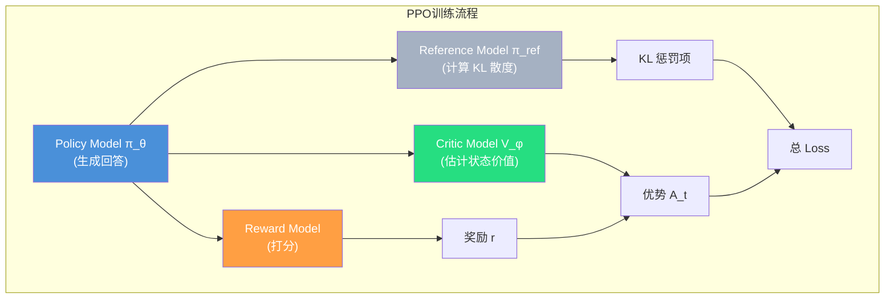

# PPO：近端策略优化（Proximal Policy Optimization）

> 「稳妥的探索型选手」— 4 模型 · 在线 RL · 探索强 · 成本高
>
> 论文：Schulman, J., et al. _Proximal Policy Optimization Algorithms._ arXiv:1707.06347, 2017 (OpenAI)

---
## 0. 面试讲解版


## 1. 核心思想

PPO 的核心洞察是：**策略更新幅度太大 → 训练崩溃；更新太小 → 学得太慢**。因此，PPO 通过"裁剪"概率比率 $r_t(\theta)$，将每次策略更新的步长限制在一个安全的范围内。

> **直觉理解**：想象你在走钢丝——PPO 就是在你脚下放了一对"夹板"，确保你的每一步（策略更新）不会偏离太远（clip 到 $[1-\epsilon, 1+\epsilon]$），从而避免从钢丝上掉下来（训练崩溃）。

---

## 2. 四个模型

PPO 需要 **4 个模型**协同工作，这是其显存开销大的根本原因：



| 模型 | 作用 | 参数是否更新 |
|------|------|:-:|
| **Policy π_θ** | 当前正在训练的策略（LLM） | ✅ 更新 |
| **Reference π_ref** | 参考模型（SFT 后的初始版本），提供 KL 约束基准 | ❌ 冻结 |
| **Reward Model** | 对生成回答打分 | ❌ 冻结（预训练好） |
| **Critic V_φ** | 状态价值函数，估计状态价值，用于 GAE | ✅ 更新 |

---

## 3. 概率比率

PPO 首先计算新旧策略的概率比率：

$$
r_t(\theta) = \frac{\pi_\theta(a_t | s_t)}{\pi_{\theta_{\text{old}}}(a_t | s_t)}
$$

> **解释**：
>
> - $\pi_\theta(a_t|s_t)$：**当前策略**在状态 $s_t$ 下选择动作 $a_t$ 的概率
> - $\pi_{\theta_{\text{old}}}$：**旧策略**（上一轮迭代）的概率
> - $r_t(\theta) > 1$：新策略比旧策略**更喜欢**这个动作（概率增大了）
> - $r_t(\theta) < 1$：新策略比旧策略**更不喜欢**这个动作（概率减小了）
> - 如果 $r_t(\theta)$ 偏离 1 太多，说明策略变化太大，有风险

---

## 4. 裁剪代理目标函数（PPO 的核心创新）

**Clipped Surrogate Objective**：

$$
L^{\text{CLIP}}(\theta) = \mathbb{E}_t \Big[ \min \big( r_t(\theta) \cdot \hat{A}_t, \; \text{clip}(r_t(\theta), 1-\epsilon, 1+\epsilon) \cdot \hat{A}_t \big) \Big]
$$

> **逐项拆解**：
>
> - $\hat{A}_t$：优势函数估计（Advantage），衡量动作 $a_t$ 比平均水平好多少
> - $r_t(\theta) \cdot \hat{A}_t$：标准的策略梯度目标（概率比率 × 优势）
> - $\text{clip}(r_t(\theta), 1-\epsilon, 1+\epsilon)$：将概率比率限制在 $[1-\epsilon, 1+\epsilon]$ 范围内
> - $\epsilon$：裁剪范围，通常设为 **0.2**
> - $\min(\cdot, \cdot)$：取两者较小值 → **悲观估计**（宁可少更新也不要冒进）

### 裁剪的两种情况

| 情况 | 优势 $\hat{A}_t$ | 比率 $r_t(\theta)$ | PPO 的做法 |
|------|:-:|:-:|-----|
| **好动作** | $\hat{A}_t > 0$ | $r_t > 1+\epsilon$ | 裁剪到 $1+\epsilon$（不让奖励太好动作过头） |
| **坏动作** | $\hat{A}_t < 0$ | $r_t < 1-\epsilon$ | 裁剪到 $1-\epsilon$（不让惩罚太重动作过头） |

---

## 5. 优势函数：GAE
大白话：算优势的时候不只看下一步好坏，还要柔和得参考后面连续好几步的表现

PPO 使用 **广义优势估计（Generalized Advantage Estimation, GAE）** 计算优势：

$$
\hat{A}_t = \sum_{l=0}^{\infty} (\gamma \lambda)^l \delta_{t+l}
$$

其中时序差分残差为：

$$
\delta_t = r_t + \gamma V(s_{t+1}) - V(s_t)
$$

> **解释**：
>
> - $\delta_t$（TD 残差）：当前奖励 + 折扣后下一状态价值 - 当前状态价值，衡量"惊喜"程度
> - $\gamma$：折扣因子（通常 0.99），未来奖励的权重
> - $\lambda$：GAE 参数（通常 0.95），平衡偏差与方差：
>   - $\lambda=0$ → 仅看一步（低方差高偏差）
>   - $\lambda=1$ → 看到终止（高方差低偏差）
>   - $(\gamma \lambda)^l$ 越往后的步骤，权重指数级衰减
> - $V(s)$：状态价值函数，由 Critic 模型估计
> - **PPO 需要额外训练一个 Critic 模型来估计 $V(s)$**，这是 PPO 显存开销大的主要原因

---

## 6. 完整 PPO 目标函数

PPO 的完整损失函数包含三项：

$$
L^{\text{PPO}}(\theta) = L^{\text{CLIP}}(\theta) - c_1 \cdot L^{\text{VF}}(\theta) + c_2 \cdot S[\pi_\theta](s_t)
$$

> **三项的含义**：
>
> - $L^{\text{CLIP}}(\theta)$：策略梯度损失（裁剪后的代理目标）
> - $L^{\text{VF}}(\theta) = \big(V_\theta(s_t) - \hat{R}_t\big)^2$：价值函数损失（Critic 的 MSE），让 Critic 更准确
> - $S[\pi_\theta](s_t) = -\sum_a \pi_\theta(a|s_t) \log \pi_\theta(a|s_t)$：熵奖励，鼓励探索
> - $c_1$：价值损失系数（通常 0.5）
> - $c_2$：熵系数（通常 0.01）

---

## 7. 在 LLM RLHF 中的应用

先看基本映射关系：

| RL 概念 | LLM RLHF 对应 |
|---------|---------------|
| 状态 $s_t$ | prompt $x$ + 已生成 tokens $y_{<t}$（用户提问 + 上文对话历史） |
| 动作 $a_t$ | 下一个 token $y_t$ |
| 策略 $\pi_\theta(a\|s)$ | LLM 的下一个 token 概率分布 |
| 奖励 $r$ | 奖励模型对完整回答的打分（通常是序列级而非 token 级） |
| Critic $V(s)$ | 额外的 Value 模型，估计当前状态的期望奖励 |
| $Q(s,a)$ | 动作价值：状态 + 特定动作，从头到尾的完整收益 |

---

### 7.1 S / V / Q / A 四大概念拆解

> PPO 的一切计算都围绕四个符号展开：**S**（状态）、**V(s)**（状态价值）、**Q(s,a)**（动作价值）、**A(s,a)**（优势）。把这四个搞懂，PPO 就没有黑盒了。

#### 1️⃣ S · State 状态（基础原材料）

S 就是当前环境输入，是所有计算的**起点**。

- **LLM RLHF 场景**：$s_t$ = 用户提问 + 上文对话历史 + 已生成的 tokens
- 整套流程的所有计算，**全部围绕状态 S 展开**

#### 2️⃣ V(s) · 状态价值（平均分标尺）

**Critic 网络专门输出 V(s)**。

$$
V^\pi(s) = \mathbb{E}_\pi\left[\sum_{t=0}^{\infty} \gamma^t r_t \,\Big|\, s_0 = s\right]
$$

- **含义**：处于状态 $s$，随便选任意动作，长期能拿到的平均总奖励
- **作用**：充当**基准线**，用来对比动作好坏

#### 3️⃣ Q(s,a) · 动作价值（选这个动作能拿多少分）

$$
Q^\pi(s, a) = \mathbb{E}_\pi\left[\sum_{t=0}^{\infty} \gamma^t r_t \,\Big|\, s_0 = s, a_0 = a\right]
$$

- **含义**：给定状态 $s$，执行动作 $a$（大模型生成一段回答），从头到尾折算的总奖励
- **Q 代表「状态 + 特定动作」的完整收益**

#### 4️⃣ A(s,a) · 优势函数（相对差值，真正用来更新模型）

$$
A(s, a) = Q(s, a) - V(s)
$$

**核心逻辑**：用整体平均分 $V$ 做减法，抵消场景本身自带的分数，**只留下动作本身的好坏差值**。

| 优势符号 | 含义 | 更新方向 |
|:-:|---|---|
| $A > 0$ | 这个动作比平均水平**更好** | 提升生成概率 |
| $A < 0$ | 这个动作**不如平均** | 压低概率 |
| $A = 0$ | 跟平均一样 | 不用调整 |

:::tip 一句话总结
V 是平均分、Q 是具体分、A 是差值。**PPO 樯梯度时乘的不是 Q 而是 A**，目的就是降低方差、让训练更稳定。
:::

---

### 7.2 PPO 完整训练链路

将四个符号串起来，完整一个 PPO 训练步它的流程如下：

```
① 输入状态 S
     ↓
② Actor 输出动作 a（生成回答）
     ↓
③ Reward Model 打分 → 得到 Q(s, a)（整条轨迹总回报）
     ↓
④ Critic 预估当前状态平均分 V(s)
     ↓
⑤ A = Q − V     （梯度更新的核心权重）
     ↓
⑥ 乘重要性采样比率 r_t = π_θ / π_old（修正新旧模型分布偏差）
     ↓
⑦ 套 Clip 损失 → 反向更新 Actor + Critic
```

对应到公式：

$$
L^{PPO}(\theta) = \mathbb{E}_t\left[\min\left(\underbrace{r_t(\theta)}_{\text{重要性采样}} \cdot \underbrace{A_t}_{\text{优势}},\ \text{clip}(r_t(\theta), 1-\epsilon, 1+\epsilon) \cdot A_t\right)\right]
$$

---

## 8. 优缺点

### ✅ 优点

- **探索能力强**：在线采样 + 熵奖励，能发现训练数据中不存在的策略
- **理论成熟**：自 2017 年以来有大量工程经验和最佳实践
- **通用性好**：适用于连续/离散动作空间、单步/多步任务
- **训练稳定**：裁剪机制有效防止策略崩溃

### ❌ 缺点

- **训练成本最高**：需要 4 个模型同时驻留显存（Policy + Ref + Reward + Critic）
- **工程复杂度高**：需要协调多个模型的前向/反向传播、经验回放池等
- **超参数敏感**：$\epsilon$, $\lambda$, $c_1$, $c_2$, $\beta$, 学习率等需精心调参
- **Critic 模型训练困难**：Value 函数在高维空间（如 LLM 的 token 序列）中难以准确估计

---

## 9. 代表应用

| 系统 | 说明 |
|------|------|
| **ChatGPT / GPT-4** | RLHF 阶段核心优化器 |
| **LLaMA 2-Chat** | Meta 开源 RLHF 标杆实现 |
| **OpenAI Five** | Dota 2 击败世界冠军 OG 战队 |
| **Tesla FSD** | 自动驾驶决策策略 |
| **Boston Dynamics Spot** | 运动控制 sim-to-real |

---

## 10. 关键超参数默认值

| 参数 | 典型值 | 说明 |
|------|:-:|------|
| $\epsilon$ | 0.2 | 裁剪范围 |
| $\gamma$ | 0.99 | 折扣因子 |
| $\lambda$ | 0.95 | GAE 参数 |
| $c_1$ | 0.5 | 价值损失系数 |
| $c_2$ | 0.01 | 熵奖励系数 |
| $\beta$ | 0.01~0.1 | KL 惩罚系数（LLM RLHF 场景） |

---

## 🔗 相关章节

- [02-grpo](./02-grpo) — GRPO 如何在 PPO 基础上去掉 Critic
- [03-dpo](./03-dpo) — DPO 如何完全去掉 RL 循环
- [04-comparison](./04-comparison) — 三算法横向对比 / 演进 / 变体 / 选型
