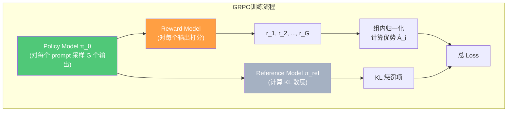

# GRPO：组相对策略优化（Group Relative Policy Optimization）

> 「推理任务的性价比之王」— 3 模型 · 组内归一化 · 省 Critic 显存
>
> 论文：Shao, Z., et al. _DeepSeekMath: Pushing the Limits of Mathematical Reasoning in Open Language Models._ arXiv:2402.03300, 2024 (DeepSeek)

---

## 1. 核心思想

GRPO 的核心创新是：**去掉 Critic 模型，用同一 prompt 的多个采样输出进行组内归一化，直接得到优势估计**。这不仅节省了大量显存，还天然适合"有明确对错"的推理任务（如数学、代码）。

> **直觉理解**：PPO 需要一个"评委"（Critic）来告诉你"这道题大概能得几分"。GRPO 的方法是——**同一道题做 64 次，算出平均分和标准差，你的得分减去平均分再除以标准差，就是你的优势**。不需要评委，只需要统计！

---

## 2. 三个模型

对比 PPO：**省掉了 Critic 模型**（$V_\phi$），这是 GRPO 最显著的工程收益。

---

## 3. 组采样与优势估计

对每个 prompt $q$，GRPO 采样一组 $G$ 个候选输出 $\{o_1, o_2, \ldots, o_G\}$（典型 $G=64$），每个输出获得奖励 $\{r_1, r_2, \ldots, r_G\}$。

**组内归一化优势**：

$$
\hat{A}_i = \frac{r_i - \text{mean}(r_{1:G})}{\text{std}(r_{1:G}) + \epsilon_{\text{small}}}
$$

> **逐项拆解**：
>
> - $r_i$：第 $i$ 个候选输出的奖励
> - $\text{mean}(r_{1:G})$：组内 $G$ 个输出的平均奖励（baseline）
> - $\text{std}(r_{1:G})$：组内奖励的标准差
> - $\epsilon_{\text{small}}$：防止除零的小常数（如 $10^{-8}$）
> - **关键洞察**：用组内均值替代了 Critic 模型的 $V(s)$！这是一个零成本的 baseline。

### 为什么有效？

$$
\text{Advantage}_i = r_i - \text{baseline}(s)
$$

在 REINFORCE 中，baseline 只要不依赖于动作即可。GRPO 用组内均值作为 baseline 是完全合理的——它不依赖于具体哪个输出 $o_i$。

---

## 4. GRPO 目标函数

$$
\mathcal{J}_{\text{GRPO}}(\theta) = \mathbb{E}_{\substack{q \sim P(Q) \\ \{o_i\}_{i=1}^G \sim \pi_{\theta_{\text{old}}}(\cdot|q)}} \left[ \frac{1}{G} \sum_{i=1}^{G} \frac{1}{|o_i|} \sum_{t=1}^{|o_i|} \Big\{ \min\big[\rho_{i,t}(\theta) \cdot \hat{A}_i, \;\; \text{clip}\big(\rho_{i,t}(\theta),\; 1-\varepsilon,\; 1+\varepsilon\big) \cdot \hat{A}_i\big] - \beta \cdot \mathbb{D}_{KL}^{(t)} \Big\} \right]
$$

其中 token 级重要性比率为：

$$
\rho_{i,t}(\theta) = \frac{\pi_\theta(o_{i,t} \mid q, o_{i,<t})}{\pi_{\theta_{\text{old}}}(o_{i,t} \mid q, o_{i,<t})}
$$

### 4.1 逐项拆解

下面从外到内逐层拆解目标函数中的每一项。

#### 最外层：期望 $\mathbb{E}$

$$
\mathbb{E}_{\substack{q \sim P(Q) \\ \{o_i\}_{i=1}^G \sim \pi_{\theta_{\text{old}}}(\cdot|q)}}
$$

- $q \sim P(Q)$：从问题分布 $P(Q)$ 中采样 prompt $q$（例如数学题库、代码题库）
- $\{o_i\}_{i=1}^G \sim \pi_{\theta_{\text{old}}}(\cdot|q)$：对每个 prompt $q$，用**旧策略** $\pi_{\theta_{\text{old}}}$ 采样 $G$ 个候选回答

> **为什么是旧策略？** 因为策略梯度需要在"行为策略"（收集数据的策略）下计算期望。如果用当前 $\theta$ 采样，每更新一步就要重新生成数据，成本极高。用 $\theta_{\text{old}}$ 可以在一个 epoch 内复用同一批数据做多步更新，再重新采样。

#### 第一层求和：组内平均 $\frac{1}{G} \sum_{i=1}^{G}$

- $G$：组大小（group size），典型值 64
- $\frac{1}{G}$：对 $G$ 个候选取平均，归一化为"每个候选的平均收益"

#### 第二层求和：token 级平均 $\frac{1}{|o_i|} \sum_{t=1}^{|o_i|}$

- $|o_i|$：第 $i$ 个候选输出的 token 数
- $\frac{1}{|o_i|}$：**长度归一化**，确保长回答和短回答对梯度的贡献权重相当

> **争议点**：Dr. GRPO 论文认为这个 $\frac{1}{|o_i|}$ 会引入**长度偏差**——它使得长回答的每个 token 梯度被稀释，模型为了获得更大的 token 级梯度信号，倾向于生成短回答；但在训练后期又可能反向膨胀。Dr. GRPO 直接移除了这一项。

#### 核心项 1：概率比率 $\rho_{i,t}(\theta)$

$$
\rho_{i,t}(\theta) = \frac{\pi_\theta(o_{i,t} \mid q, o_{i,<t})}{\pi_{\theta_{\text{old}}}(o_{i,t} \mid q, o_{i,<t})}
$$

- 分子：**当前策略** 在给定 prompt $q$ 和已生成前缀 $o_{i,<t}$ 下生成第 $t$ 个 token 的概率
- 分母：**旧策略**生成同一 token 的概率
- $\rho > 1$：新策略更倾向；$\rho < 1$：更不倾向；$\rho = 1$：无变化

> **为什么需要比率而非直接用概率？** 数据是旧策略采的（off-policy 修正）。乘以 $\rho$ 可以将旧策略下的期望修正为新策略下的期望，这是重要性采样的原理。

#### 核心项 2：优势估计 $\hat{A}_i$

$$
\hat{A}_i = \frac{r_i - \text{mean}(r_{1:G})}{\text{std}(r_{1:G}) + \epsilon_{\text{small}}}
$$

- 在数学任务中 $r_i$ 通常是 0（错）或 1（对），也可以是连续值（部分得分）
- $\hat{A}_i > 0$：这个回答比组内平均**好**（增加生成它的概率）
- $\hat{A}_i < 0$：这个回答比组内平均**差**（减少生成它的概率）

> **关键对比 PPO**：PPO 用 Critic 模型 $V_\phi(s)$ 估计 baseline，需要额外一个大模型；GRPO 用组内均值替代，**零额外参数**。代价是需要采样 $G$ 个输出（PPO 通常只采样 1 个）。

> **Dr. GRPO 的简化**：移除 $\text{std}$ 归一化，优势变为 $\hat{A}_i = r_i - \text{mean}(r_{1:G})$。理由是标准差归一化对"全对"或"全错"的简单/难题产生不合理信号。

#### 核心项 3：裁剪机制 $\min[\cdot, \text{clip}(\cdot) \cdot \hat{A}_i]$

$$
\min\big[\underbrace{\rho_{i,t}(\theta) \cdot \hat{A}_i}_{\text{项 A：正常}}, \;\; \underbrace{\text{clip}\big(\rho_{i,t}(\theta),\; 1-\varepsilon,\; 1+\varepsilon\big) \cdot \hat{A}_i}_{\text{项 B：裁剪后}}\big]
$$

- $\varepsilon$：裁剪范围，通常 **0.2**，$\rho$ 被允许在 $[0.8, 1.2]$ 范围内自由变化
- $\min$：取较小值，**悲观策略**——宁可少更新也不要冒进

**两种情况的具体行为**：

| 情况 | $\hat{A}_i$ | $\rho$ | 项 A | 项 B | min 取谁 | 效果 |
|------|:-:|:-:|:-:|:-:|:-:|-----|
| 好动作，未超范围 | $>0$ | $[1, 1+\varepsilon]$ | $\rho \cdot \hat{A}$ | $\rho \cdot \hat{A}$ | 相等 | 正常增大概率 |
| 好动作，已超范围 | $>0$ | $> 1+\varepsilon$ | $\rho \cdot \hat{A}$ | $(1+\varepsilon)\cdot \hat{A}$ | **项 B** | 停止继续增大 |
| 坏动作，未超范围 | $<0$ | $[1-\varepsilon, 1]$ | $\rho \cdot \hat{A}$ | $\rho \cdot \hat{A}$ | 相等 | 正常减小概率 |
| 坏动作，已超范围 | $<0$ | $< 1-\varepsilon$ | $\rho \cdot \hat{A}$（更负） | $(1-\varepsilon)\cdot \hat{A}$ | **项 A** | 继续减小，但不反向 |

> **最微妙的点**：当 $\hat{A}_i < 0$ 且 $\rho < 1-\varepsilon$ 时，$\min$ 取的是项 A（未裁剪的），而非项 B。因为此时策略已经在正确方向上（减小坏动作概率），继续减小是安全的，裁剪反而会阻碍正确的更新。这就是 PPO 裁剪机制的非对称性——**限制"做太多好事"，但允许"继续避免坏事"**。

#### 核心项 4：KL 散度惩罚 $-\beta \cdot \mathbb{D}_{KL}^{(t)}$

- $\beta$：KL 惩罚系数（如 0.04），控制策略偏离参考模型的强度
- 负号：这是要**最大化**的目标，KL 是惩罚项所以取负

**KL 散度的近似计算**：

$$
\mathbb{D}_{KL}^{(t)} \approx \frac{\pi_{\text{ref}}(o_{i,t} \mid q, o_{i,<t})}{\pi_\theta(o_{i,t} \mid q, o_{i,<t})} - \log\frac{\pi_{\text{ref}}(o_{i,t} \mid q, o_{i,<t})}{\pi_\theta(o_{i,t} \mid q, o_{i,<t})} - 1
$$

令 $u = \frac{\pi_{\text{ref}}}{\pi_\theta}$，则 $\mathbb{D}_{KL} \approx u - \log u - 1$。当 $\pi_\theta = \pi_{\text{ref}}$ 时 $u=1$，$\mathbb{D}_{KL} = 0$（无偏差）。

> **与 PPO 的关键区别**：PPO 将 KL 惩罚加到 **reward** 中（$r_{\text{total}} = r - \beta \cdot \mathbb{D}_{KL}$），再通过 GAE 传播到优势估计。GRPO **直接将 KL 加到 loss** 中，使 KL 约束更直接可控——不经过优势估计的平滑，每个 token 都受到独立的 KL 约束。

### 4.2 一句话翻译整条公式

> 对每个问题采样 64 个回答 → 算出每个回答比组内平均水平好/差多少（$\hat{A}_i$）→ 用概率比率 $\rho$ 修正采样偏差 → 用 clip 防止策略更新过猛 → 用 KL 惩罚防止遗忘已有能力 → 对所有 token 取平均 → 对所有候选取平均 → 对所有 prompt 取期望 → 最大化这个目标。

### 4.3 GRPO vs PPO 关键区别对照

| 组成部分 | PPO | GRPO |
|---------|-----|------|
| **优势计算** | GAE（需要 Critic） | 组内归一化（无需 Critic） |
| **KL 惩罚位置** | 加到 reward 中 | **直接加到 loss 中**（减去 $\beta \cdot \mathbb{D}_{KL}$） |
| **裁剪机制** | 有 | 有（继承自 PPO） |
| **归一化** | 无 | 每输出按 $1/\|o_i\|$ 归一化 |

### 4.4 公式符号速查表

| 符号 | 含义 | 典型值 |
|------|------|:-:|
| $\theta$ | 当前策略模型参数 | — |
| $\theta_{\text{old}}$ | 采样时的旧策略参数 | — |
| $\pi_{\text{ref}}$ | 参考模型（SFT 后初始模型） | — |
| $P(Q)$ | 训练数据 prompt 分布 | — |
| $G$ | 组大小（每 prompt 采样数） | 8~64 |
| $\|o_i\|$ | 第 $i$ 个输出的 token 长度 | — |
| $r_i$ | 第 $i$ 个输出的奖励值 | 0 或 1 |
| $\hat{A}_i$ | 组内归一化优势 | $[-3, 3]$ |
| $\rho_{i,t}(\theta)$ | token 级重要性采样比率 | $\approx 1$ |
| $\varepsilon$ | 裁剪范围 | 0.1~0.2 |
| $\beta$ | KL 正则化系数 | 0.001~0.04 |
| $\epsilon_{\text{small}}$ | 除零平滑常数 | $10^{-8}$ |
| $\mathbb{D}_{KL}^{(t)}$ | token 级 KL 散度 | $\geq 0$ |

---

## 5. 为什么 GRPO 适合推理任务？

**核心原因：推理任务有客观标准（对/错），奖励分布是双峰的（全对 = 1，全错 = 0）**。

在数学竞赛题中：

- 组内 64 个采样中，可能有 20 个答对（$r=1$），44 个答错（$r=0$）
- $\text{mean} = 20/64 \approx 0.31$，$\text{std} \approx 0.47$
- 答对的优势 $\hat{A} = (1 - 0.31)/0.47 \approx 1.47$（**强正向信号**）
- 答错的优势 $\hat{A} = (0 - 0.31)/0.47 \approx -0.66$（**强负向信号**）

这种清晰的奖励差异产生了**极强的学习信号**，远胜于主观偏好任务中模糊的连续奖励。

---

## 6. 显存节省分析

| 模型 | PPO | GRPO | 节省 |
|------|:-:|:-:|-----|
| Policy | ✅ | ✅ | — |
| Reference | ✅ | ✅ | — |
| Reward Model | ✅ | ✅ | — |
| Critic / Value | ✅ | ❌ | **节省约 50%**（对于 70B 模型，省掉一个 70B Critic 的参数 + 优化器状态 + 梯度 ≈ 数百 GB） |

> **注意**：这里的"50%"是指训练时需要同时驻留显存的模型参数总量。去掉 Critic 模型后，梯度、优化器状态等也相应减少。

---

## 7. 优缺点

### ✅ 优点

- **省显存**：去掉 Critic 模型，节省约 50%（对大模型意义巨大）
- **推理任务效果好**：组内归一化天然适配有明确对错的任务（数学、代码、逻辑）
- **实现更简单**：无需训练 Critic，减少工程复杂度和调参难度
- **已验证的大规模应用**：DeepSeek-R1 使用 GRPO 训练出世界领先的推理能力

### ❌ 缺点

- **采样开销大**：每个 prompt 需要采样 $G$ 个输出（典型 64 个），推理成本高
- **依赖任务可判性**：对主观性强的任务（如创意写作），组内奖励方差小，学习信号弱
- **长度偏差**：原始 GRPO 的 $\frac{1}{\|o_i\|}$ 归一化可能导致回答长度异常（Dr. GRPO 已修复）
- **难度偏差**：标准差归一化对简单/难题处理不公平（Dr. GRPO 已修复）

---

## 8. 代表应用

| 系统 | 说明 |
|------|------|
| **DeepSeek-R1 / R1-Zero** | GRPO + 规则化奖励，无需 SFT 数据涌现 CoT |
| **DeepSeek-V3** | 对齐阶段使用 GRPO |
| **Qwen 2.5** | 借鉴 group relative 训练策略 |

---

## 🔗 相关章节

- [01-ppo](./01-ppo) — PPO 原理（GRPO 的前身）
- [03-dpo](./03-dpo) — DPO 如何完全去掉 RL 循环
- [04-comparison](./04-comparison) — 三算法横向对比 + Dr. GRPO / DAPO / GSPO 等变体
