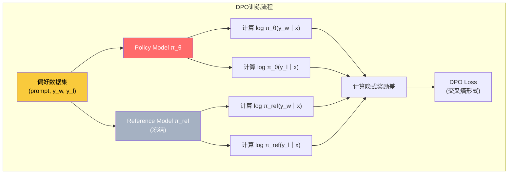

# DPO：直接偏好优化（Direct Preference Optimization）

> 「极简的离线优化器」— 2 模型 · 无 RL 循环 · 稳定 · 探索弱
>
> 论文：Rafailov, R., et al. _Direct Preference Optimization: Your Language Model is Secretly a Reward Model._ NeurIPS 2023 / arXiv:2305.18290, 2023 (Stanford)

---

## 1. 核心思想

DPO 的核心洞察是：**RLHF 目标函数有一个优美的解析解**。与其用复杂的 RL 循环去近似求解，不如直接利用这个解析解，将 RLHF 转化为一个简单的分类问题。

> **直觉理解**：PPO/GRPO 像"摸着石头过河"——不断试探、获得奖励、调整策略。DPO 像"抄作业"——直接告诉你"这个回答比那个好"，你只需要学会模仿好的、避免差的。不需要奖励模型，不需要 RL 循环，就是一个带偏好标签的分类问题。

---

## 2. 两个模型

只需要 **2 个模型**（Policy + Reference），**不需要 Reward Model**、**不需要 Critic**、**不需要在线采样**。

---

## 3. 从 RLHF 到 DPO：完整推导

### 第一步：RLHF 的拉格朗日形式

RLHF 的目标是在 KL 约束下最大化奖励：

$$
\max_{\pi_\theta} \; \mathbb{E}_{x \sim \mathcal{D}, \, y \sim \pi_\theta(\cdot|x)} \big[ r(x, y) \big] \quad \text{s.t.} \quad \mathbb{D}_{KL}\big(\pi_\theta(\cdot|x) \;\|\; \pi_{\text{ref}}(\cdot|x)\big) \leq \epsilon
$$

转化为无约束的拉格朗日形式：

$$
\max_{\pi_\theta} \; \mathbb{E}_{y \sim \pi_\theta(\cdot|x)} \big[ r(x, y) \big] - \beta \cdot \mathbb{D}_{KL}\big(\pi_\theta(\cdot|x) \;\|\; \pi_{\text{ref}}(\cdot|x)\big)
$$

### 第二步：求解析解

展开 KL 散度并重新排列：

$$
\max_{\pi_\theta} \; \mathbb{E}_{y \sim \pi_\theta(\cdot|x)} \left[ r(x,y) - \beta \log \frac{\pi_\theta(y|x)}{\pi_{\text{ref}}(y|x)} \right]
$$

这等价于：

$$
\max_{\pi_\theta} \; \sum_y \pi_\theta(y|x) \left[ r(x,y) - \beta \log \frac{\pi_\theta(y|x)}{\pi_{\text{ref}}(y|x)} \right]
$$

对 $\pi_\theta(y|x)$ 求导并令导数为零（使用变分法），可得闭式解：

$$
\pi^*(y|x) = \frac{1}{Z(x)} \pi_{\text{ref}}(y|x) \exp\left(\frac{r(x,y)}{\beta}\right)
$$

> **解释**：
>
> - $Z(x) = \sum_y \pi_{\text{ref}}(y|x) \exp(r(x,y)/\beta)$：归一化常数（**配分函数**），确保 $\pi^*$ 是合法的概率分布
> - $\exp(r(x,y)/\beta)$：奖励越高，最优策略分配的概率越大（**指数加权**）
> - $\beta$：温度参数
>   - $\beta$ 越小 → 越贪婪（更倾向高奖励）
>   - $\beta$ 越大 → 越接近参考策略

### 第三步：反解奖励函数

从解析解中反解出 $r(x,y)$：

$$
r(x,y) = \beta \log \frac{\pi^*(y|x)}{\pi_{\text{ref}}(y|x)} + \beta \log Z(x)
$$

> **这就是 DPO 的核心魔法**：最优策略和参考策略的**对数概率比**本身就是奖励的一种表达！不需要单独训练奖励模型。

### 第四步：代入 Bradley-Terry 模型

人类偏好建模通常使用 **Bradley-Terry 模型**：给定偏好对 $(y_w, y_l)$（$w$=赢的/更好的，$l$=输的/更差的），人类偏好 $y_w$ 胜过 $y_l$ 的概率为：

$$
P(y_w \succ y_l | x) = \sigma\big(r(x, y_w) - r(x, y_l)\big)
$$

> **解释**：
>
> - $\sigma(\cdot)$：sigmoid 函数 $\sigma(z) = \frac{1}{1+e^{-z}}$，将奖励差映射到 $(0,1)$ 区间
> - $r(x,y_w) - r(x,y_l)$：偏好回答与不偏好回答的奖励差，差越大 → 偏好概率越接近 1

将第三步的奖励表达式代入：

$$
P(y_w \succ y_l | x) = \sigma\Big(\beta \log\frac{\pi^*(y_w|x)}{\pi_{\text{ref}}(y_w|x)} - \beta \log\frac{\pi^*(y_l|x)}{\pi_{\text{ref}}(y_l|x)} + \underbrace{\beta \log Z(x) - \beta \log Z(x)}_{\text{消去！}}\Big)
$$

> **关键观察**：$Z(x)$ 只依赖 prompt $x$，在配对比较中**完全消去**！这是 DPO 能去掉奖励模型的理论基础。

---

## 4. DPO 损失函数

最终的 DPO 损失函数为负对数似然：

$$
\mathcal{L}_{\text{DPO}}(\theta) = -\mathbb{E}_{(x, y_w, y_l) \sim \mathcal{D}}
\left[
\log \sigma\left(
\beta \log \frac{\pi_\theta(y_w|x)}{\pi_{\text{ref}}(y_w|x)}
-
\beta \log \frac{\pi_\theta(y_l|x)}{\pi_{\text{ref}}(y_l|x)}
\right)
\right]
$$

定义**隐式奖励**：

$$
\hat{r}_\theta(x, y) = \beta \log \frac{\pi_\theta(y|x)}{\pi_{\text{ref}}(y|x)}
$$

则损失函数简写为：

$$
\mathcal{L}_{\text{DPO}}(\theta) = -\mathbb{E}_{(x, y_w, y_l)}
\left[ \log \sigma\big(\hat{r}_\theta(x, y_w) - \hat{r}_\theta(x, y_l)\big) \right]
$$

> **解释**：
>
> - $\hat{r}_\theta(x, y_w)$：当前策略对偏好回答的**隐式奖励**
> - $\hat{r}_\theta(x, y_l)$：当前策略对不偏好回答的**隐式奖励**
> - 目标：**最大化 $\hat{r}_\theta(y_w) - \hat{r}_\theta(y_l)$**，即拉开好回答和坏回答的奖励差
> - 这就是一个二分类问题：让模型学会"偏好 $y_w$ 而非 $y_l$"
> - $\beta$：温度参数（通常 0.1），控制偏离参考模型的程度

---

## 5. DPO 的梯度分析

DPO 的梯度有直观的物理意义：

$$
\nabla_\theta \mathcal{L}_{\text{DPO}} = -\beta \cdot \mathbb{E}_{(x,y_w,y_l)}
\Big[
\underbrace{\hat{r}_\theta(x,y_w) - \hat{r}_\theta(x,y_l)}_{\text{奖励差越大→梯度越小}}
\Big]
$$

更精确地：

$$
\nabla_\theta \mathcal{L}_{\text{DPO}} = \beta \cdot \mathbb{E}_{(x,y_w,y_l)}
\left[
\frac{1}{1+e^{\hat{r}_\theta(y_w) - \hat{r}_\theta(y_l)}}
\big(
\underbrace{\nabla_\theta \log\pi_\theta(y_l|x)}_{\text{降低坏回答概率}}
-
\underbrace{\nabla_\theta \log\pi_\theta(y_w|x)}_{\text{提高好回答概率}}
\big)
\right]
$$

> **梯度行为的直觉**：
>
> - 当模型已经能很好分辨好坏时（$\hat{r}_\theta(y_w) - \hat{r}_\theta(y_l)$ 很大）→ 梯度权重 $\frac{1}{1+e^{\Delta}}$ 趋近于 0 → **不再大幅更新**（已经学会了）
> - 当模型分辨能力差时（$\Delta$ 接近 0 或为负）→ 梯度权重接近 0.5 → **大幅更新**（还没学会，需要学）
> - 这种自适应的学习率与 PPO 的裁剪机制**异曲同工**

---

## 6. 优缺点

### ✅ 优点

- **最简单**：无需 RL 循环、无需奖励模型、无需在线采样
- **训练稳定**：转化为标准分类问题，无策略崩溃风险
- **显存最低**：仅需 2 个模型（Policy + Reference）
- **数据效率高**：直接利用离线偏好数据，无需额外的采样/标注
- **易于实现**：几行代码即可实现核心 loss

### ❌ 缺点

- **探索能力有限**：只能从已有偏好数据中学习，无法发现数据分布之外的新策略
- **依赖数据质量**：偏好数据中的噪声（标注错误、不一致）会直接影响训练效果
- **分布漂移问题**：当 $\pi_\theta$ 偏离 $\pi_{\text{ref}}$ 较远时，对数概率比可能不稳定
- **缺乏在线反馈**：训练过程中模型无法获取新的奖励信号，改进受限于固定数据集

---

## 7. 代表应用

| 系统 | 说明 |
|------|------|
| **Zephyr-7B** | HuggingFace 推出，SFT + DPO 流程，MT-Bench 7.34 分（当时最强 7B） |
| **LLaMA 3 / 3.1** | 对齐阶段同时使用 DPO 和 PPO |
| **Mixtral Instruct** | 采用 DPO 进行对齐 |
| **开源社区大量 finetune** | DPO 已成为最流行的对齐方法之一 |

---

## 8. 关键超参数默认值

| 参数 | 典型值 | 说明 |
|------|:-:|------|
| $\beta$ | 0.1 | 温度参数，控制偏离参考模型的程度 |
| Learning Rate | 5e-7 ~ 5e-6 | 通常比 SFT 更小 |
| Batch Size | 32 ~ 128 | 视显存决定 |
| Training Steps | 1~3 epoch | 通常单 epoch 即可 |

---

## 🔗 相关章节

- [01-ppo](./01-ppo) — PPO 原理（DPO 的推导起点）
- [02-grpo](./02-grpo) — GRPO：在线 RL 但去 Critic
- [04-comparison](./04-comparison) — 三算法横向对比 + SimPO / KTO 等 DPO 变体
