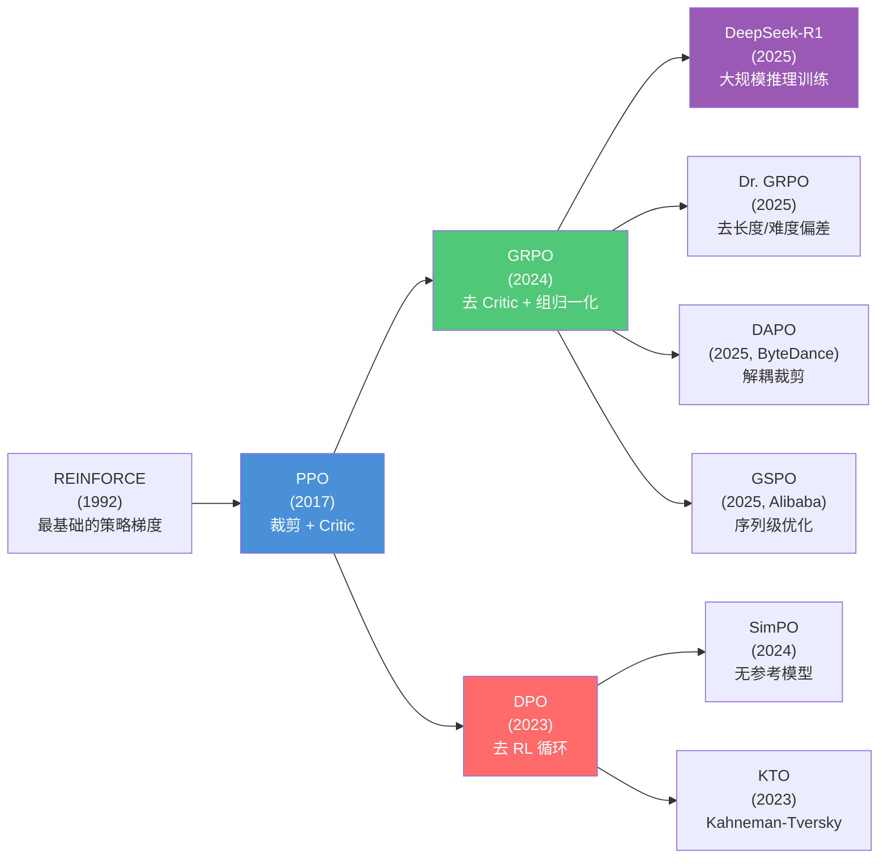
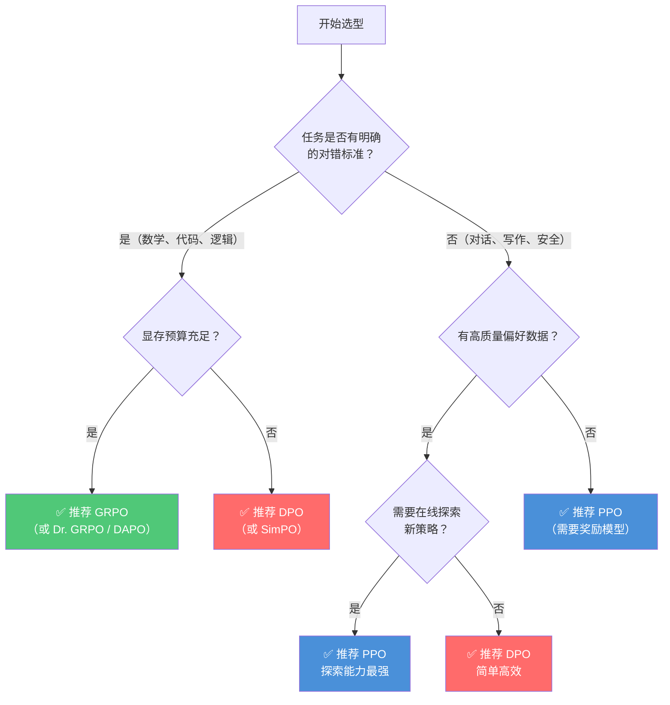

# PPO / GRPO / DPO 横向对比

> 汇总三算法差异 · 演进关系 · 最新变体 · 选型指南 · 公式符号速查
>
> 单算法详细原理：[PPO](./01-ppo) · [GRPO](./02-grpo) · [DPO](./03-dpo)

---

## 1. 快速对比表

| 维度 | PPO | GRPO | DPO |
|------|-----|------|-----|
| **全称** | Proximal Policy Optimization | Group Relative Policy Optimization | Direct Preference Optimization |
| **提出时间** | 2017 (OpenAI) | 2024 (DeepSeek) | 2023 (Stanford) |
| **核心论文** | Schulman et al. | DeepSeekMath / Shao et al. | Rafailov et al. |
| **所需模型数** | 4 (Policy + Ref + Reward + Critic) | 3 (Policy + Ref + Reward) | 2 (Policy + Ref) |
| **训练范式** | 在线 RL（On-policy） | 在线 RL（On-policy） | 离线学习 |
| **是否需要 RL 循环** | ✅ 是 | ✅ 是 | ❌ 否 |
| **是否需要奖励模型** | ✅ 是 | ✅ 是 | ❌ 否（隐式） |
| **是否需要 Critic** | ✅ 是 | ❌ 否 | ❌ 否 |
| **优势估计方式** | GAE（广义优势估计） | 组内归一化奖励 | 不需要（直接优化偏好） |
| **探索能力** | ⭐⭐⭐ 最强 | ⭐⭐ 强 | ⭐ 有限 |
| **训练稳定性** | ⭐⭐ 中（需调参） | ⭐⭐ 中 | ⭐⭐⭐ 最稳定 |
| **训练成本（显存）** | 最高（4 模型同显存） | 中等（省 Critic ~50%） | 最低（仅 2 模型） |
| **适合场景** | 通用对齐、复杂任务 | 推理任务（数学、代码） | 快速偏好对齐 |

---

## 2. 演进路线图

**递进关系总结**：**PPO → GRPO（去 Critic）→ DPO（去 RL 循环）**——逐步降低工程复杂度，但也逐步牺牲探索能力。

---

## 3. 三大维度对比

### 3.1 优势估计方式

| 算法 | 优势计算 | 需要 Critic? | Baseline |
|------|----------|:-:|----------|
| **PPO** | GAE：$\hat{A}_t = \sum (\gamma\lambda)^l \delta_{t+l}$ | ✅ 需要 | Critic $V(s)$ |
| **GRPO** | 组内归一化：$\hat{A}_i = (r_i - \bar{r}) / \text{std}(r)$ | ❌ 不需要 | 组内均值 $\bar{r}$ |
| **DPO** | 不需要优势估计 | ❌ 不需要 | 参考模型 $\pi_{\text{ref}}$ |

### 3.2 KL 约束实现

| 算法 | KL 约束位置 | 实现方式 |
|------|------------|----------|
| **PPO** | 加到 reward 中 | $r_{\text{total}} = r - \beta \cdot \mathbb{D}_{KL}$ |
| **GRPO** | 直接加到 loss 中 | $\mathcal{L} = L^{\text{CLIP}} - \beta \cdot \mathbb{D}_{KL}$ |
| **DPO** | 隐含在目标函数中 | $\beta \log(\pi_\theta/\pi_{\text{ref}})$ 自动约束 |

### 3.3 训练流程

```mermaid
graph TB
    subgraph PPO流程["PPO 训练循环"]
        PA["1. 生成回答"] --> PB["2. Reward Model 打分"]
        PB --> PC["3. Critic 估计 V(s)"]
        PC --> PD["4. GAE 计算优势"]
        PD --> PE["5. 计算概率比率并裁剪"]
        PE --> PF["6. 更新 Policy + Critic"]
        PF --> PA
    end

    subgraph GRPO流程["GRPO 训练循环"]
        GA["1. 每个 prompt 采样 G 个回答"] --> GB["2. Reward Model 打分"]
        GB --> GC["3. 组内归一化计算优势"]
        GC --> GD["4. 计算概率比率并裁剪"]
        GD --> GE["5. 更新 Policy"]
        GE --> GA
    end

    subgraph DPO流程["DPO 训练（无循环）"]
        DA["1. 准备偏好数据集<br/>(prompt, y_w, y_l)"] --> DB["2. 计算隐式奖励比"]
        DB --> DC["3. 优化 DPO Loss"]
    end

    style PPO流程 fill:#4A90D920
    style GRPO流程 fill:#50C87820
    style DPO流程 fill:#FF6B6B20
```

---

## 4. 最新改进变体

### 4.1 Dr. GRPO（GRPO Done Right, 2025）

**问题**：原始 GRPO 存在两个偏差来源。

**改进**：移除了两项导致偏差的归一化：

| 偏差来源 | 原始 GRPO | Dr. GRPO |
|----------|-----------|----------|
| **长度偏差** | 每个 output 按 $\frac{1}{\|o_i\|}$ 归一化 | 移除 → 不再惩罚长回答 |
| **难度偏差** | 除以 $\text{std}(r_{1:G})$ | 移除 → 简单题和难题同等对待 |

**Dr. GRPO 优势函数**：

$$
\hat{A}_i^{\text{Dr.GRPO}} = r_i - \text{mean}(r_{1:G})
$$

> **为什么移除长度归一化？** 在训练后期，模型倾向于生成越来越长的回答来"堆砌"得分点，导致回答长度爆炸。长度归一化 $\frac{1}{\|o_i\|}$ 会惩罚长回答的 token 级梯度，但这也会误伤有价值的详细解释。移除后，模型不再有长度偏差。
>
> **为什么移除标准差归一化？** 对于简单题（大多数输出都答对，$\text{std} \approx 0$），标准差归一化会放大噪声梯度；对于难题（大多数答错），又会压制有效信号。移除后，$\hat{A}_i = r_i - \bar{r}$ 直接反映相对优劣。

### 4.2 DAPO（ByteDance, 2025）

DAPO（**D**ecoupled clip and dynamic s**A**mpling **P**olicy **O**ptimization）针对 GRPO 提出四项改进：

1. **Clip-Higher（解耦裁剪）**：对正负优势使用不同的裁剪阈值 $\epsilon_{\text{low}}$ 和 $\epsilon_{\text{high}}$，放宽正优势的上限以鼓励探索
2. **动态采样（Dynamic Sampling）**：过滤掉"全对"（所有 $G$ 个输出都正确）和"全错"（全部错误）的 prompt 组，因为它们不产生有效梯度信号
3. **Token 级策略梯度损失**：使用 token 级损失替代序列级平均，避免长回答稀释梯度
4. **超长奖励整形（Overlong Reward Shaping）**：对超出长度限制的回答给予软惩罚而非硬截断

### 4.3 GSPO（Alibaba, 2025）

GSPO（**G**roup **S**equence **P**olicy **O**ptimization）的核心改进：

- 将 token 级重要性比率 $\rho_{i,t}(\theta)$ 替换为**序列级比率** $\rho_i(\theta) = \prod_{t=1}^{|o_i|} \rho_{i,t}(\theta)$
- 降低梯度方差，训练更稳定
- 特别适合 **MoE（混合专家）模型**，因为 MoE 模型中不同 token 可能激活不同专家，token 级比率波动大

### 4.4 SimPO（Simple Preference Optimization, 2024）

SimPO 在 DPO 基础上的改进：

- **去掉参考模型**：用回答的平均对数概率 $\frac{\beta}{|y|} \log \pi_\theta(y|x)$ 替代对数比率 $\beta \log \frac{\pi_\theta(y|x)}{\pi_{\text{ref}}(y|x)}$
- 引入目标奖励差 $\gamma$：

$$
\mathcal{L} = -\mathbb{E}\Big[\log\sigma\Big(\tfrac{\beta}{|y_w|}\log\pi_\theta(y_w|x) - \tfrac{\beta}{|y_l|}\log\pi_\theta(y_l|x) - \gamma\Big)\Big]
$$

- 进一步减少显存（**只需 1 个模型**）和工程复杂度

### 4.5 变体一览

| 变体 | 基于 | 核心改进 | 提出方 |
|------|:-:|----------|--------|
| **Dr. GRPO** | GRPO | 移除长度/难度偏差 | 2025 学界 |
| **DAPO** | GRPO | Clip-Higher + Dynamic Sampling + Token-Level Loss + Overlong Shaping | ByteDance 2025 |
| **GSPO** | GRPO | 序列级比率，适配 MoE | Alibaba 2025 |
| **SimPO** | DPO | 无参考模型，加长度归一化 + 目标奖励差 | 2024 |
| **KTO** | DPO | Kahneman-Tversky，仅需二元好坏标签 | 2023 |
| **VAPO** | PPO | Value-Augmented PPO，改进 value 估计 | ByteDance 2025 |
| **Iterative/Online DPO** | DPO | DPO + 在线采样迭代 | LLaMA 3 对齐 |

---

## 5. 优缺点总结

### 5.1 PPO

**优点**：
- 探索能力强：在线采样 + 熵奖励，能发现训练数据中不存在的策略
- 理论成熟：自 2017 年以来有大量工程经验和最佳实践
- 通用性好：适用于连续/离散动作空间、单步/多步任务
- 训练稳定：裁剪机制有效防止策略崩溃

**缺点**：
- 训练成本最高：需要 4 个模型同时驻留显存（Policy + Ref + Reward + Critic）
- 工程复杂度高：需要协调多个模型的前向/反向传播、经验回放池等
- 超参数敏感：$\epsilon$, $\lambda$, $c_1$, $c_2$, $\beta$, 学习率等需精心调参
- Critic 模型训练困难：Value 函数在高维空间（如 LLM 的 token 序列）中难以准确估计

### 5.2 GRPO

**优点**：
- 省显存：去掉 Critic 模型，节省约 50% 显存（对于大模型意义巨大）
- 推理任务效果好：组内归一化天然适配有明确对错的任务（数学、代码、逻辑）
- 实现更简单：无需训练 Critic，减少了工程复杂度和调参难度
- 已验证的大规模应用：DeepSeek-R1 使用 GRPO 训练出世界领先的推理能力

**缺点**：
- 采样开销大：每个 prompt 需要采样 $G$ 个输出（典型 64 个），推理成本高
- 依赖任务可判性：对主观性强的任务（如创意写作），组内奖励方差小，学习信号弱
- 长度偏差：原始 GRPO 的 $\frac{1}{\|o_i\|}$ 归一化可能导致回答长度异常（Dr. GRPO 已修复）
- 难度偏差：标准差归一化对简单/难题处理不公平（Dr. GRPO 已修复）

### 5.3 DPO

**优点**：
- 最简单：无需 RL 循环、无需奖励模型、无需在线采样
- 训练稳定：转化为标准分类问题，无策略崩溃风险
- 显存最低：仅需 2 个模型（Policy + Reference）
- 数据效率高：直接利用离线偏好数据，无需额外的采样/标注
- 易于实现：几行代码即可实现核心 loss

**缺点**：
- 探索能力有限：只能从已有偏好数据中学习，无法发现数据分布之外的新策略
- 依赖数据质量：偏好数据中的噪声（标注错误、不一致）会直接影响训练效果
- 分布漂移问题：当 $\pi_\theta$ 偏离 $\pi_{\text{ref}}$ 较远时，对数概率比可能不稳定
- 缺乏在线反馈：训练过程中模型无法获取新的奖励信号，改进受限于固定数据集

---

## 6. 选型指南

### 场景推荐

- **大规模推理训练（数学、代码竞赛）**：GRPO / Dr. GRPO / DAPO → 已被 DeepSeek-R1 验证
- **快速偏好对齐（对话风格、安全过滤）**：DPO / SimPO → 简单、稳定、低成本
- **复杂通用任务（需强探索能力）**：PPO → 探索能力最强但成本最高
- **MoE 模型训练**：GSPO → 序列级优化适配专家路由机制
- **显存受限场景**：DPO > SimPO（只需 1 个模型）> GRPO（3 模型）> PPO（4 模型）

---

## 7. 公式符号速查表

### 通用符号

| 符号 | 含义 | 备注 |
|------|------|------|
| $\pi_\theta$ | 策略模型（当前正在训练的 LLM） | 参数为 $\theta$ |
| $\pi_{\text{ref}}$ | 参考模型（通常是 SFT 后的模型） | 参数冻结 |
| $\pi_{\theta_{\text{old}}}$ | 上一轮迭代的策略 | 用于计算概率比率 |
| $r(x, y)$ | 奖励函数 / 奖励模型输出 | $x$=prompt, $y$=response |
| $V(s)$ / $V_\phi(s)$ | 状态价值函数（Critic 模型） | 估计状态 $s$ 的期望累积奖励 |
| $\hat{A}$ / $\hat{A}_t$ | 优势估计 | 衡量动作比平均水平好多少 |
| $\gamma$ | 折扣因子 | 通常 0.99 |
| $\lambda$ | GAE 参数 | 通常 0.95 |
| $\epsilon$ | PPO/GRPO 裁剪范围 | 通常 0.2 |
| $\beta$ | KL 惩罚 / 温度系数 | 控制策略偏离参考模型的程度 |
| $\mathbb{D}_{KL}$ | KL 散度 | 衡量两个分布的差异 |
| $\sigma(\cdot)$ | Sigmoid 函数 | $\sigma(z) = \frac{1}{1+e^{-z}}$ |
| $G$ | GRPO 组大小（采样数） | 典型值 64 |
| $c_1$ | 价值损失系数 | 通常 0.5 |
| $c_2$ | 熵奖励系数 | 通常 0.01 |

### PPO 特有符号

| 符号 | 含义 |
|------|------|
| $r_t(\theta)$ | 新旧策略的概率比率 $\frac{\pi_\theta(a_t\|s_t)}{\pi_{\theta_{\text{old}}}(a_t\|s_t)}$ |
| $L^{\text{CLIP}}$ | 裁剪代理目标函数 |
| $L^{\text{VF}}$ | 价值函数损失（Critic 的 MSE） |
| $S[\pi_\theta]$ | 策略熵 $\sum_a \pi_\theta(a\|s) \log \pi_\theta(a\|s)$ |
| $\delta_t$ | 时序差分残差 $r_t + \gamma V(s_{t+1}) - V(s_t)$ |

### GRPO 特有符号

| 符号 | 含义 |
|------|------|
| $q$ | prompt / 问题 |
| $o_i$ | 第 $i$ 个候选输出 |
| $r_i$ | 第 $i$ 个输出的奖励 |
| $\text{mean}(r_{1:G})$ | 组内 $G$ 个输出的平均奖励 |
| $\text{std}(r_{1:G})$ | 组内 $G$ 个输出的奖励标准差 |
| $\rho_{i,t}(\theta)$ | Token 级重要性比率 |
| $\|o_i\|$ | 输出 $o_i$ 的长度（token 数） |

### DPO 特有符号

| 符号 | 含义 |
|------|------|
| $y_w$ | 偏好回答（chosen / winner） |
| $y_l$ | 不偏好回答（rejected / loser） |
| $Z(x)$ | 配分函数（归一化常数） |
| $\hat{r}_\theta(x,y)$ | DPO 隐式奖励 $\beta \log \frac{\pi_\theta(y\|x)}{\pi_{\text{ref}}(y\|x)}$ |
| $\mathcal{D}$ | 偏好数据集 $\{(x, y_w, y_l)\}$ |

---

## 8. 参考文献

### 核心论文

1. **PPO**: Schulman, J., et al. "Proximal Policy Optimization Algorithms." arXiv:1707.06347, 2017.
2. **GRPO**: Shao, Z., et al. "DeepSeekMath: Pushing the Limits of Mathematical Reasoning in Open Language Models." arXiv:2402.03300, 2024.
3. **DPO**: Rafailov, R., et al. "Direct Preference Optimization: Your Language Model is Secretly a Reward Model." NeurIPS 2023 / arXiv:2305.18290, 2023.
4. **DeepSeek-R1**: DeepSeek-AI. "DeepSeek-R1: Incentivizing Reasoning Capability in LLMs via Reinforcement Learning." arXiv:2501.12948, 2025.
5. **GAE**: Schulman, J., et al. "High-Dimensional Continuous Control Using Generalized Advantage Estimation." arXiv:1506.02438, 2015.

### 改进变体

6. **Dr. GRPO**: Liu, Z., et al. "Understanding R1-Zero-Like Training: Unnecessary Suppression of 'Long and Wrong' Reasoning." 2025.
7. **DAPO**: ByteDance. "DAPO: An Open-Source Lean Data-Driven Reinforcement Learning Recipe." 2025.
8. **GSPO**: Alibaba. "GSPO: Group Sequence Policy Optimization." 2025.
9. **SimPO**: Meng, Y., et al. "SimPO: Simple Preference Optimization with a Reference-Free Reward." arXiv:2405.14734, 2024.
10. **KTO**: Ethayarajh, K., et al. "KTO: Model Alignment as Prospect Theoretic Optimization." ICML 2024, 2023.

### 综述与背景

11. **RLHF综述**: Ouyang, L., et al. "Training language models to follow instructions with human feedback." NeurIPS 2022.
12. **Bradley-Terry 模型**: Bradley, R. A. & Terry, M. E. "Rank Analysis of Incomplete Block Designs: I. The Method of Paired Comparisons." 1952.

---

## 🔗 相关章节

- [索引](/docs/rl-post-training/algorithms) — 知识库总入口
- [01-ppo](/docs/rl-post-training/algorithms/01-ppo) — PPO 独立章节
- [02-grpo](/docs/rl-post-training/algorithms/02-grpo) — GRPO 独立章节
- [03-dpo](/docs/rl-post-training/algorithms/03-dpo) — DPO 独立章节

